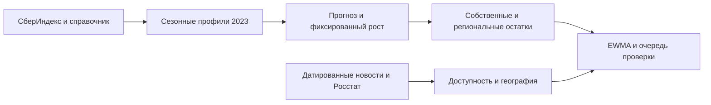
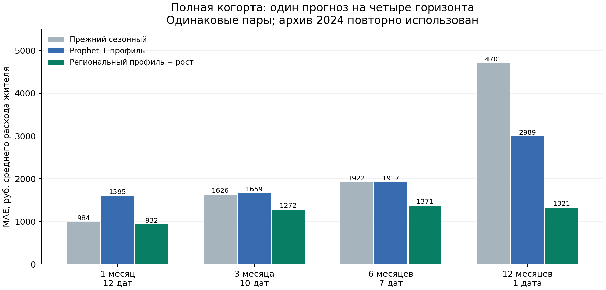
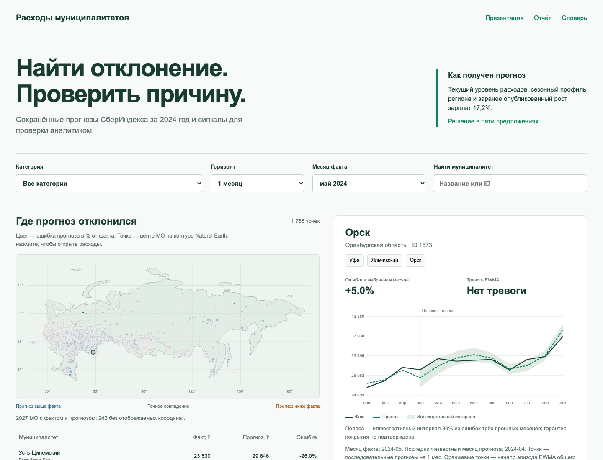

<p align="center"></p>

# Прогноз расходов МО и сигналы изменений

Решение задачи №2 конкурса СберИндекса: прогноз средних месячных безналичных расходов жителей муниципалитетов и обнаружение изменений динамики.

**[Публичный репозиторий](https://github.com/NikitaMeshDS/sberindex-task2) · [Интерактивный сайт](https://NikitaMeshDS.github.io/sberindex-task2/)**

**Материалы:** [презентация PDF](artifacts/presentation.pdf) · [слайды PPTX](artifacts/presentation.pptx) · [русский отчёт](docs/research/SUBMISSION_REPORT.md) · [запуск](docs/GETTING_STARTED.md) · [критерии](docs/COMPETITION.md) · [интерактивный интерфейс](dashboard/index.html) · [короткое объяснение](docs/research/SOLUTION_IN_FIVE_SENTENCES.md).

## Результаты и материалы

| Направление | Результат | Где смотреть |
|---|---|---|
| Понятность методологии | **Формула и объяснение словами** | [Презентация](artifacts/presentation.pdf), слайд 4; [отчёт](docs/research/SUBMISSION_REPORT.md), §1 и 3 |
| Прогноз и четыре горизонта | **−41,5 / −23,3 / −28,5 / −55,8% MAE¹** | [Презентация](artifacts/presentation.pdf), слайды 5–9; [отчёт](docs/research/SUBMISSION_REPORT.md), §3 |
| Детекторы изменений | **EWMA: F1 0,647; ложные тревоги 0,046²** | [Презентация](artifacts/presentation.pdf), слайды 13–15; [отчёт](docs/research/SUBMISSION_REPORT.md), §5 |
| Фундаментальные модели | **Chronos-2, TimesFM 2.5, Moirai 2, TiRex; Bolt** | [Презентация](artifacts/presentation.pdf), слайды 5, 10–11; [отчёт](docs/research/SUBMISSION_REPORT.md), §4 |
| Новости и согласование | **Текст, цитата, МО и доступность; прогноз и детекция** | [Презентация](artifacts/presentation.pdf), слайд 16; [отчёт](docs/research/SUBMISSION_REPORT.md), §6 |
| MAE и R² | **MAE всех горизонтов; R² изменений внутри МО** | [Презентация](artifacts/presentation.pdf), слайды 5–7; [отчёт](docs/research/SUBMISSION_REPORT.md), §3 |
| Интерпретация и воспроизводимость | **Уфа, Яльчикский, Орск; интерфейс; SHA256** | [Презентация](artifacts/presentation.pdf), слайды 12, 15, 17, 20; [отчёт](docs/research/SUBMISSION_REPORT.md), §7–8 |

¹ Снижение к **одному контролю — Prophet с сезонным профилем**. Условные 95% интервалы по регионам не содержат ноль; это не независимый временной тест. На h12 одна дата. Сравнение с лучшим из трёх Prophet даёт 54,5%, а с фиксированным контролем — 55,8%.

² Оценочная синтетика: тревоги на 100 МО-месяцев. Реальная частота ложных тревог неизвестна; дополнительные новости не увеличили число эпизодов.

## Метод

Одна модель для горизонтов **1, 3, 6 и 12 месяцев**: отношение сезонных профилей, смесь общего и регионального профиля с весом 0,5 и фиксированная поправка роста зарплат Росстата 17,2%. Профили используют историю 2023 года; макропоказатель опубликован до декабрьского происхождения прогноза.

EWMA выбран по F1 начала изменения на отдельной синтетической выборке с бюджетом ложных тревог. Дополнительный канал вычитает медиану остатков других МО региона и выделяет локальную динамику. Общий региональный сдвиг требует собственного канала.



## Результаты прогноза

MAE в рублях средних расходов жителя; одинаковые пары всех моделей, сценарий лага публикации 0.

| Горизонт | Региональный профиль + рост | Prophet с сезонным профилем | Снижение MAE | Целевых дат |
|---|---:|---:|---:|---:|
| 1 месяц | 932 | 1595 | 42% | 12 |
| 3 месяца | 1272 | 1659 | 23% | 10 |
| 6 месяцев | 1371 | 1917 | 28% | 7 |
| 12 месяцев | 1321 | 2989 | 56% | 1 |

[Полные метрики MAE и R²](reports/growth_bridge_review/summary.csv) · [правило выбора](reports/growth_bridge_review/selection.json) · [чувствительность к росту](reports/growth_sensitivity_review/REPORT.md).




## Детекторы, новости и реальный пример

- EWMA: F1 начала **0,647**, recall **0,583**, null-тревоги **0,046 на 100 МО-месяцев** в оценочной синтетике. [Сравнение восьми методов](reports/short_history_review/REPORT.md).
- Региональный остаток: **18** эпизодов EWMA на **24 081** наблюдаемый МО-месяц против **145 / 24 282** для собственного остатка. Это нагрузка мониторинга, а не измеренная частота ложных тревог. [Проверка всей панели](reports/peer_residual_review/REPORT.md).
- Орск: разрыв годового роста с Оренбургом вырос в мае до **9,19 п.п.**, но четыре замороженных метода не дали тревоги ни в одном канале. Время до тревоги цензурировано; новость не выдаётся за предсказание паводка. [Реальный кейс](reports/peer_residual_review/case_yoy.csv).
- Исторический корпус: **81 публикация МЧС из архивного поиска по 13 регионам**, сохранённые даты и снимки. Покрытие частичное; пропуски неизвестны. [Новости и согласование времени](reports/mchs_archive_review/REPORT.md).
- Chronos-2 с группами категорий и профилями снижает свою MAE на **27%**, но уступает сезонному контролю на той же 251-ID когорте. [Foundation-сравнение](reports/foundation_covariate_review/REPORT.md).

Предсказание будущих реальных структурных сдвигов расходов пока не доказано. Выплаты и восстановление после паводка — проверяемая объясняющая гипотеза; связь с агрегированными расходами не является причинным выводом.

## Расширенные проверки

- [Доверительные интервалы и временные тесты](reports/forecast_uncertainty_review/REPORT.md): интервалы выигрыша по МО и регионам не содержат ноль; исследовательская чувствительность Holm по h1/h3 даёт p=0,034 на h1 и p=0,307 на h3. Исходная поправка по шести тестам сохранена.
- [TimesFM 2.5, Moirai 2, TiRex и дообучение Chronos-Bolt](reports/foundation_expansion_review/REPORT.md): одинаковые пары, сезонные отношения и фиксированные ансамбли. [Десять моделей на полной панели](reports/foundation_expansion_review/FULLPANEL_REPORT.md).
- [Перенос одной модели на шесть категорий](reports/category_growth_review/REPORT.md), без перенастройки годового роста.
- [Локальное извлечение событий Qwen](reports/news_event_extraction_review/field_validation_variant/REPORT.md), [новостный порог детектора](reports/event_conditioned_review/REPORT.md) и [накопительный сигнал](reports/yoy_shift_review/REPORT.md): отрицательные результаты сохранены.
- [Восстановление текстов МЧС](reports/news_body_recovery_20261007/REPORT.md): 103 различных текста с восстановленным содержимым в трёх партиях, 12 проверенных фрагментов, 3 ID МО (2 в панели). Снижение порога оставило 145 эпизодов; улучшение обнаружения не доказано.
- [Локальный интерфейс](dashboard/index.html): карта центров МО, факт и прогноз, иллюстративные интервалы, очередь тревог и доступные новости. Открывается без интернета.

## Рассчитать прогноз на новых данных

Сайт показывает готовые результаты. Выбранную модель можно отдельно запустить на своих месячных CSV/Parquet — без полного архива и весов:

```bash
python3.12 -m venv .venv
source .venv/bin/activate
python -m pip install -r requirements-inference.txt
python predict.py --config configs/predict.json
```

Измените пути, дату расчёта, год профиля, категорию, горизонты и рост в [configs/predict.json](configs/predict.json). Пример создаёт 8092 прогноза для 2023 МО; результаты и хеши входов — в `run_outputs/forecast_2025_example/`. [Формат данных и все параметры](docs/PREDICT_NEW_DATA.md). Прежние метрики не гарантируют качество на новом периоде.

## Быстрый запуск

```bash
git clone --depth 1 https://github.com/NikitaMeshDS/sberindex-task2.git
cd sberindex-task2
python3.12 run_review.py --mode verify
```

Нужен только Python 3.12. Команда проверяет SHA256 **компактного комплекта**: код, конфигурации, исходную таблицу СберИндекса и итоговые материалы. Успех — JSON `"status": "passed"`. Проверка не обучает модели и не подтверждает научные выводы сама по себе. Эталонные MAE: **932 / 1272 / 1371 / 1321 руб.**

Откройте [dashboard/index.html](dashboard/index.html) для автономного просмотра результатов или [интерактивный сайт](https://nikitameshds.github.io/sberindex-task2/). Первое открытие занимает несколько секунд: браузер загружает около 6 МБ сохранённых данных.

Альтернативный запуск: `docker build -t sberindex-task2 .`, затем `docker run --rm sberindex-task2` (проверка целостности). [Docker и новый прогноз](docs/GETTING_STARTED.md#docker).

### Стандартный запуск тестов

Тесты требуют полной среды из `requirements-lock.txt`, включая Prophet и ruptures. `requirements-inference.txt` предназначен только для рабочего прогноза.

```bash
python -m pip install -r requirements-lock.txt
python -m unittest discover -s tests
```

Ожидается **181 тест, `OK (skipped=7)`**. В компактном комплекте семь проверок сохранённых архивных файлов явно пропускаются с пояснением; проверки алгоритмов и хронологии выполняются. Полный исследовательский снимок содержит данные для всех своих 189 тестов и проходит без этих пропусков. Установка зависимостей также устанавливает локальный пакет; `PYTHONPATH` задавать не нужно.

### Полное воспроизведение исследований

Большие снимки источников, индивидуальные прогнозы и технические аудиты вынесены в [замороженный исследовательский архив](https://github.com/NikitaMeshDS/sberindex-task2/releases/tag/research-snapshot-20261008-clean). Они не удалены из комплекта сдачи. Очищенный архив содержит 1477 файлов; его полный манифест пересчитан после удаления служебных формулировок и нормализации локальных путей; загрузчик проверяет SHA256 и распаковывает его в отдельную папку:

```bash
python3.12 tools/download_research_snapshot.py
cd research_workspace
python3.12 run_review.py --mode verify
```

Полная проверка должна подтвердить **997 файлов**. Для тестов и пересчёта установите зависимости внутри этой папки:

```bash
git init  # внутри research_workspace: отдельная история для нового пересчёта
python3.12 -m venv .venv
source .venv/bin/activate
python -m pip install -r requirements-lock.txt
PYTHONPATH=src:. python -m unittest discover -s tests -q
python run_review.py --mode recompute
```

Архив — около 241 МБ; распакованный комплект — около 320 МБ без среды и весов. Проверка сохранённых материалов занимает секунды. Тесты полного снимка: **189**, проверены на Apple Silicon и Linux. Полный пересчёт требует загрузки весов; время зависит от оборудования и отдельных моделей, фиксированную длительность не заявляем. Подробности и границы проверенных запусков — в `research_workspace/docs/GETTING_STARTED.md`.

Код и конфигурации всех сравнений сохранены в основной ветке. Отдельные исследовательские тесты и сборщики используют входы из полного архива: запускайте их из `research_workspace`, а не из компактного комплекта.

## Интерактивный просмотр

[Откройте `dashboard/index.html`](dashboard/index.html) после распаковки полного или компактного архива. Выберите МО, категорию, горизонт и месяц: карта, факт и прогноз, иллюстративный интервал, очередь EWMA и доступные публикации. Это просмотр сохранённых результатов, не сервис новых прогнозов.

[](dashboard/index.html)

[Публичный репозиторий](https://github.com/NikitaMeshDS/sberindex-task2) · [Открыть интерактивный сайт](https://NikitaMeshDS.github.io/sberindex-task2/). Репозиторий для сдачи содержит компактный комплект без внутренней исследовательской истории. Автономный интерфейс также входит в архив и работает без сервера.

## JSON-конфигурации

[config.json](config.json) — исходные горизонты, модели, seed и настройки основного benchmark. [configs/](configs/) — параметры отдельных опытов; [полный справочник](docs/CONFIGURATION.md). Изменение конфигурации не меняет уже сохранённые результаты.

<details>
<summary>Назначение каждого файла configs/</summary>

| Файл | Назначение |
|---|---|
| [adaptive_growth_holdout.json](configs/adaptive_growth_holdout.json) | Второй прогноз 2025: региональная медиана годового роста |
| [category_growth_review.json](configs/category_growth_review.json) | Перенос одной формулы на шесть категорий |
| [detectors.json](configs/detectors.json) | Параметры EWMA, CUSUM и BOCPD |
| [direct_horizon_review.json](configs/direct_horizon_review.json) | Direct HGB по отдельным горизонтам |
| [event_conditioned_review.json](configs/event_conditioned_review.json) | Фиксированный новостной множитель порога |
| [event_metric_review.json](configs/event_metric_review.json) | Синтетические формы шоков и методы детекции |
| [forecast_uncertainty_review.json](configs/forecast_uncertainty_review.json) | Блочные интервалы и временные тесты |
| [foundation_covariate_review.json](configs/foundation_covariate_review.json) | Chronos с известными сезонными ковариатами |
| [foundation_expansion_review.json](configs/foundation_expansion_review.json) | TimesFM, Moirai, TiRex, ансамбли и обучение Bolt |
| [full_cohort_review.json](configs/full_cohort_review.json) | Prophet на полной пригодной панели МО |
| [grouped_intervals.json](configs/grouped_intervals.json) | Групповая калибровка прогнозных интервалов |
| [growth_bridge_review.json](configs/growth_bridge_review.json) | Выбранная сезонная модель с ростом Росстата |
| [growth_sensitivity_review.json](configs/growth_sensitivity_review.json) | Диагностическая сетка ставок роста |
| [hierarchical_review.json](configs/hierarchical_review.json) | Веса общего и регионального сезонных профилей |
| [interval_calibration.json](configs/interval_calibration.json) | Калибровка прогнозных интервалов |
| [news_interval_review.json](configs/news_interval_review.json) | Фиксированная диагностика радиуса интервала ×1,5 при доступном сообщении |
| [news_event_extraction_review.json](configs/news_event_extraction_review.json) | Модель и ограничения извлечения новостных событий |
| [operational_workflow.json](configs/operational_workflow.json) | Прежний демонстрационный выпуск и лаги доступности |
| [peer_residual_review.json](configs/peer_residual_review.json) | Региональный остаток и проверка нагрузки тревог |
| [prophet_seasonality.json](configs/prophet_seasonality.json) | Усиленные сезонные варианты Prophet |
| [residual_features.json](configs/residual_features.json) | Признаки для поправки ошибок прогноза |
| [review_real_cases.json](configs/review_real_cases.json) | Официальные события и выбранные реальные МО |
| [selected_model_holdout.json](configs/selected_model_holdout.json) | Исходный фиксированный прогноз выбранной модели на 2025 |
| [short_history_review.json](configs/short_history_review.json) | Детекторы при 12 месяцах истории и отдельные синтетические выборки |
| [spatial_review.json](configs/spatial_review.json) | Признаки соседних МО |
| [yoy_shift_review.json](configs/yoy_shift_review.json) | Накопительный сигнал годового роста относительно региона |

</details>

## Структура

```text
src/sberindex/     прогноз, обнаружение изменений, источники, отчётность
configs/          фиксированные JSON-настройки
tests/            проверки причинности и регрессии
docs/             методология, инструкции и научные протоколы
data/             основной датасет СберИндекса и условия использования
reports/          итоговые таблицы и краткие отчёты
results/          справочник муниципалитетов и ключевые результаты
artifacts/        итоговая презентация и её данные
dashboard/        локальный просмотр сохранённых результатов
tools/            сборка материалов и проверки
```

[Происхождение данных и лицензии](docs/DATA_USAGE.md) · [манифест источников](data_sources.json) · [архитектура](docs/ARCHITECTURE.md) · [проверка жюри](docs/JURY_START.md).


## Границы вывода

На изученных датах 2024 года интервалы выигрыша по МО и регионам не содержат ноль. В исследовательском сравнении только с Prophet + профиль на h1/h3 скорректированное p для h1 равно 0,034, для h3 — 0,307. Это дополнительная чувствительность после просмотра результатов: исходная поправка по шести тестам даёт h1 p=0,102. Независимое временное превосходство не установлено; на h12 лишь одна дата.

Для проверки 2025 сохранены два файла выбранной формулы: [фиксированный рост 17,2%](reports/selected_model_holdout_20261007/freeze_manifest.json) и [региональная медиана последних трёх годовых темпов](reports/adaptive_growth_holdout_20261007/freeze_manifest.json). Каждый содержит 8092 прогнозов для одинаковых 2023 МО. Медианная региональная ставка — 14,79%; медианный уровень второго файла ниже на 2,05%. Это исторические симуляции, рассчитанные 7 октября 2026 без муниципальных фактов 2025. Второе правило предложено после просмотра результатов 2024 и сообщения об агрегате 2025; оно не является слепым тестом. Прежний [ансамбль 75/25](reports/next_holdout/freeze_manifest.json) сохранён. Независимые метрики ещё не рассчитаны.
