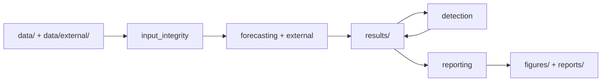
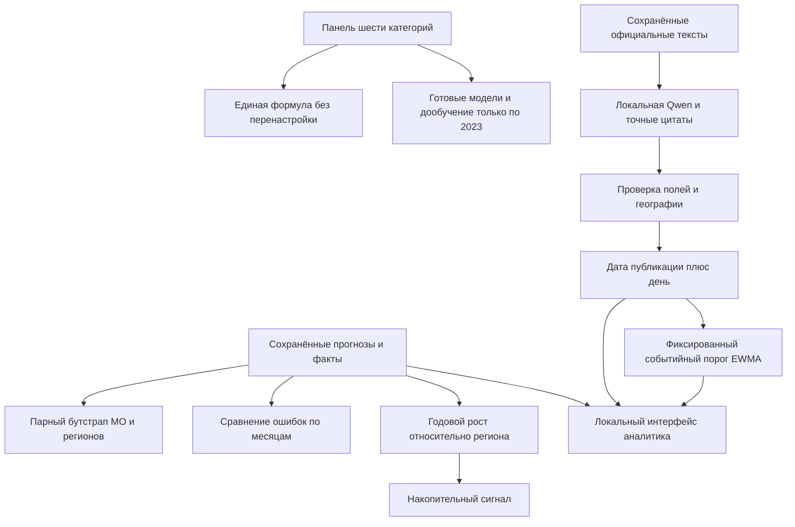

# Архитектура проекта

## Принцип размещения

Исследовательский код находится в пакете `src/sberindex/`. Файлы сгруппированы по вопросу, на который отвечают, а не по типу Python-зависимости. `run_pipeline.py` остаётся стабильной точкой входа из корня репозитория; `reproduce_check.py` — второй короткой командой для проверки переноса. Данные, производные таблицы, графики, документация и метаданные запусков живут отдельно.

| Каталог | Ответственность | Основные входы и выходы |
|---|---|---|
| `src/sberindex/forecasting/` | Прогнозы, выбор когорт, MAE/R², задержка данных, интервалы | `data/consumption.parquet` → `results/*forecast*`, `results/asof_*` |
| `src/sberindex/detection/` | Местные и общие сигналы, синтетические сдвиги, время тревоги | расходы и прогнозы → `results/change_*`, `results/event_attribution_*` |
| `src/sberindex/external/` | Внешние источники, новости, погода, география, ИПЦ | `data/external/`, `data/external/news_events.csv` → таблицы в `results/` |
| `src/sberindex/reporting/` | Интерпретация, графики, инварианты, переносная сборка | таблицы `results/` → `figures/`, `reports/` |
| `src/sberindex/paths.py` | Единый корень проекта для модулей | `ROOT`, `DATA`, `RESULTS`, `FIGURES`, `REPORTS` |
| `src/sberindex/input_integrity.py` | Проверка SHA256 исходных снимков и сохранённых модельных входов | `data_sources.json`, `refresh_inputs.json` |

Внутренние импорты используют полные имена пакетов `sberindex.*`. Каждый этап можно запустить как модуль, например `PYTHONPATH=src python -m sberindex.reporting.verify_artifacts`; обычный путь — `python run_pipeline.py --mode refresh`. Точка входа добавляет `src` в путь модулей и запускает этапы через `python -m` из корня проекта. Путь к данным берётся из `sberindex.paths.ROOT`, поэтому смена текущего рабочего каталога не меняет их расположение.

## Происхождение и поток расчёта

`--mode refresh` начинает с проверки контрольных сумм 22 сохранённых входов и пересчитывает производные материалы. Сохранённые прогнозы тяжёлых моделей являются явно объявленным кэшем; небольшие модели и дополнительный Prophet для сценария задержки обучаются заново. `--mode full` перед производными этапами пересчитывает тяжёлые модели и обновляет манифест кэша только после успешного запуска. Набор и порядок этапов зафиксированы в `run_pipeline.py`.

`results/` и `figures/` содержат проверяемые артефакты текущей исследовательской версии. `reports/` содержит сведения о воспроизведении и последнем запуске. Исторические `full_retrain_*` относятся к замороженной версии до этой реорганизации, поэтому их числа не следует выдавать за новый полный прогон. `artifacts/presentation.pdf` — итоговые 21 слайд; исходник `presentation.pptx` редактируется. Слайды собираются отдельно по сохранённым таблицам.

Проверка переноса сохранена в `reports/layout_migration_report.json`: 192 ранее отслеживаемых файла из `results/` и `figures/` совпали побайтно с коммитом до реорганизации; из минимальной временной копии в двух средах восстановлены 134 производных файла и 19 пар PNG/SVG. Это проверка структуры и воспроизводимости текущего `refresh`, а не повторное полное обучение всех моделей.

## Правила изменений

Новые исследования добавляются в соответствующий модуль по смыслу. Для этапа, входящего в сборку, обновляются список этапов `run_pipeline.py`, проверка в `src/sberindex/reporting/verify_artifacts.py` и указатель на результат в README или методологии. Новые исходные снимки регистрируются с SHA256 в `data_sources.json`; тяжёлые сохранённые входы — в `refresh_inputs.json` после полного пересчёта. Отчёты `reports/run_metadata.json` и проверки воспроизводимости подтверждают фактически выполненную версию кода, но не заменяют независимый временной тест.

## Расширение исследовательских этапов 5 октября

- `forecasting/calendar_audit.py` строит фиксированную календарную абляцию и общие пары.
- `forecasting/foundation_seasonal_audit.py` разделяет inference и `--refresh`: последний пересчитывает метрики из защищённого кэша, без загрузки torch/весов.
- `detection/asof_detector_audit.py` выбирает когорту по прошлой истории, сохраняет пропуски, проверяет причинные состояния и парные вмешательства.
- `external/regional_news_experiment.py` проверяет публикации/географию/покрытие до разрешения обучения. Официальные снимки находятся в `data/external/regional_news_expansion/`.
- `reporting/research_hypothesis_figures.py` создаёт три новых пары PNG/SVG.
- `tests/test_asof_detectors.py` проверяет инварианты когорты, будущего и пропусков.

Протоколы фиксированы в `docs/protocols/`, исследовательские тексты находятся в `docs/research/`; `results/` содержит только численные данные. Переносная пересборка копирует протоколы, поскольку они входят в хешированные входы новых опытов.

`forecasting/asof_distribution_audit.py` пересчитывает описательные распределения ошибок новых моделей из фиксированных прогнозов: пять CSV и JSON. Этап идёт после календарной и сезонной foundation-абляций. Он не обучает модели. Тесты `test_distribution_audit.py` защищают равный вес дат, строгие пары, наличие каждого исходного факта, равенства и границы групп 2023.

`forecasting/foundation_delay_audit.py` расширяет проверку публикационной задержки: новый inference h2 и повторный HGB fit 2023 по умолчанию, защищённая пересборка метрик через `--refresh`, проверка через `--verify`. Три дополнительных inference-входа зарегистрированы в `refresh_inputs.json`; четыре производные таблицы воспроизводятся без загрузки весов.

`forecasting/operational_early_audit.py` добавляет раннее h2-сравнение при задержке 1 месяц: фиксированный HGB и Prophet, пять производных таблиц, три защищённых кэша. Поздние прогнозы переиспользованы точно; параметры не выбираются заново. `--refresh` не переобучает эти модели.

`detection/detector_delay_audit.py` переносит прежние парные тревоги в календарь доступности при гипотетических лагах 0/1/2. Четыре CSV и протокол пересчитываются из сырого источника, без нового кэша. Общая проверка сверяет нулевой лаг и прежние пороги.

`detection/bocpd_audit.py` — полное Bayesian posterior и общее сравнение пяти методов. `external/real_event_registry.py` — замороженные официальные события, явные муниципальные связи и доступность кейсов. Первичные снимки в `data/external/real_event_registry/`, результаты `bocpd_*` и `real_registry_*`; оба модуля включены в refresh и verifier.

## Исполняемые настройки детекторов

`configs/detectors.json` и `detection/detector_settings.py` задают и валидируют 11 параметров EWMA/CUSUM/noise/BOCPD/threshold. Поздние as-of, calendar-delay и BOCPD аудиты фиксируют настройки на начало расчёта; изменение файла во время расчёта отвергается. Их provenance включает JSON и loader. Переносная сборка копирует `configs/`. Исторический `change_detection.py` и кэш change_robustness не переписаны. Временные окна и синтетический дизайн остаются фиксированными протоколами.

## Расширения отзыва

`forecasting/full_cohort_review.py` оценивает 2075 МО; `prophet_backend.py` сохраняет семантику старых вызовов. `hierarchical_review.py`, `direct_horizon_review.py`, `spatial_review.py`, `foundation_covariate_review.py` — отдельные фиксированные эксперименты. `external/regional_news_review.py` сохраняет корпус, географию, сценарий доступности и абляцию. `detection/event_metric_review.py` разделяет событийные метрики и момент доступности офлайн-ответа. `reporting/review_real_cases.py` явно показывает отсутствующие ряды. `run_review.py` объединяет повтор опытов и отдельную SHA-проверку. Новый победитель автоматически не заменяет рабочий выпуск.

## Расширение исследовательского контура

Расширенные варианты не заменяют основной прогноз или детектор автоматически. Таблицы сравнения фиксируют одинаковые ключи наблюдений и явно отмечают запасной HGB h12. Для готовых моделей разделены кэшированная пересборка результатов и фактическая загрузка весов/обучение в дополнительной среде.

Новости используются как контекст и в отдельных абляциях. Дата события, публикация и предполагаемая доступность независимы; неизвестное поле остаётся неизвестным. Муниципальный ID, выданный моделью текста, не считается доверенным: его разрешает официальный справочник на основе подтверждённой цитаты. Отсутствие записи не превращается в отрицательную метку.

Интерфейс `dashboard/` получает только сохранённые данные из `tools/build_research_dashboard.py`. Он показывает расходы, прогнозы и очередь проверки, без API-ключей и внешних сетевых зависимостей. Новые будущие прогнозы интерфейс не вычисляет.
