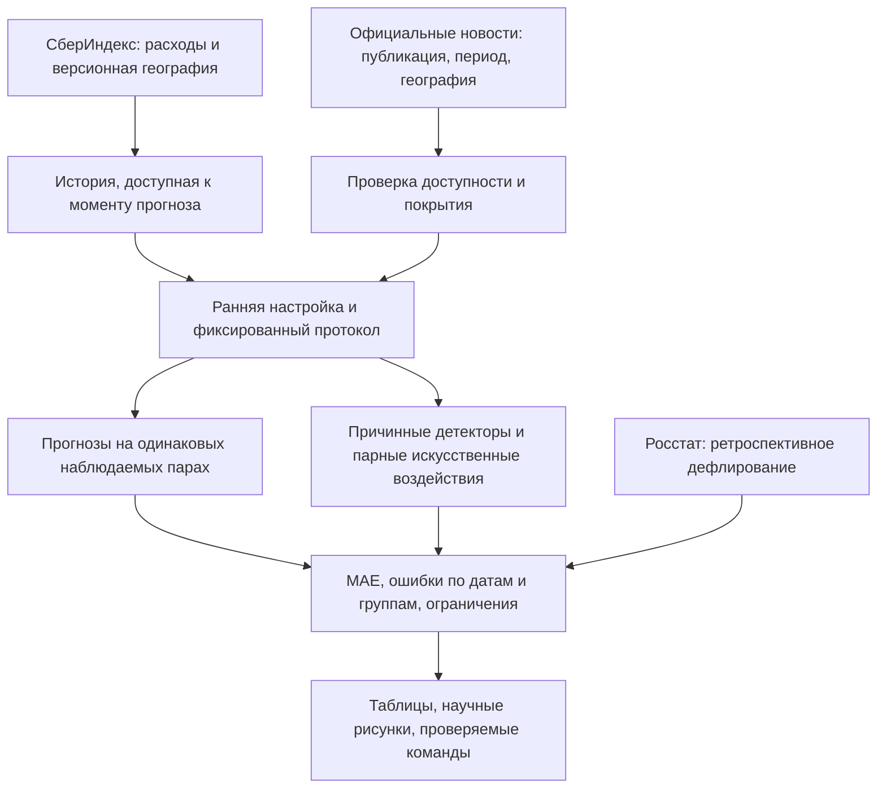

# Доказательства по критериям конкурса — 5 октября 2026

Веса взяты из задания участника. Это реестр проверяемых результатов, а не прогноз баллов жюри. Все эксперименты относятся к уже изученному архиву 2023–2024; независимого нового теста нет. Финальная презентация доступна в `artifacts/presentation.pdf`.

## Финальная модель и пакет — 6 октября 2026

Основное решение: региональный сезонный профиль с весом 0,5 и замороженной поправкой роста зарплат 17,2%; EWMA выбран по началу изменения на короткой синтетической истории. MAE на h1/h3/h6/h12: 932/1272/1371/1321 рубля. Эти оценки относятся к повторно изученному архиву, а не независимому тесту.

[Финальный русский отчёт](SUBMISSION_REPORT.md), [презентация PDF](../../artifacts/presentation.pdf), [PPTX](../../artifacts/presentation.pptx), [чувствительность роста](../../reports/growth_sensitivity_review/REPORT.md), [региональные остатки и Орск](../../reports/peer_residual_review/REPORT.md). Старые сравнительные таблицы ниже сохраняются как история исследований; они не заменяют основное сравнение всех МО.

Презентация закрывает обязательный артефакт, но не создаёт новых доказательств предсказания реальных будущих шоков. Региональный остаток не дал тревогу в Орске при прежних порогах. Публичный код и интерфейс: [репозиторий](https://github.com/NikitaMeshDS/sberindex-task2) и [сайт](https://NikitaMeshDS.github.io/sberindex-task2/).

## Путь от источника к выводу



Показатель цели — средние месячные безналичные расходы жителей МО в рублях, а не сумма оборота торговых точек. Национальные новости не становятся локальными наблюдениями; отсутствие публикации не кодируется как отсутствие события. Региональный ИПЦ Росстата из выгрузки 2026 применяется для интерпретации, без утверждения исторической доступности в 2024.

## Семь критериев

| Критерий | Доказательство и способ проверки | Вывод и предел доказательства |
|---|---|---|
| Методология, 10% | [METHODOLOGY.md](METHODOLOGY.md), схема выше, фиксированные протоколы в `docs/protocols/*_EXPERIMENT.md` | Указаны цель, момент выпуска, когорты, общие пары, пропуски и выбор параметров. Модельное происхождение и фактическое время публикации расходов — разные вопросы |
| Прогнозы, 20% | `results/asof_cohort_comparison.csv`, `asof_regional_comparison.csv`, `calendar_summary.csv`; таблица ниже | Prophet превзойдён в ретроспективных сравнениях. Главная модель не заменяется поздним поиском минимальной MAE. На 6/12 месяцах одна дата |
| Детекторы, 20% | `asof_detector_summary.csv`, `asof_detector_calibration.csv`, `asof_detector_coverage.csv`; [протокол](../protocols/DETECTOR_ASOF_EXPERIMENT.md); `figures/detector_noise_tradeoff.png` | Четыре метода, два масштаба, две когорты, шесть категорий и парные воздействия. Чувствительность и дополнительная нагрузка конфликтуют; реальные метки смены расходов отсутствуют |
| Фундаментальные модели, 15% | `foundation_seasonal_summary.csv`, `foundation_seasonal_paired_monthly.csv`, закреплённые ревизии в `config.json`; [подробный отчёт](FOUNDATION_SEASONAL_REPORT.md); `figures/foundation_seasonal_comparison.png` | Десезонирование улучшает обе Chronos по общей MAE каждого горизонта. Сезонный ориентир всё ещё лучше. Историческое пересечение с предобучением исключить нельзя |
| Новости, 15% | `news_claim_registry.csv`, `news_corpus_summary.csv`, `regional_news_experiment_coverage.csv`, `regional_news_experiment_source_rejections.csv`; [протокол](../protocols/REGIONAL_NEWS_EXPERIMENT.md) | Есть согласование публикации, доступности, периода и территории. Эффект ЦБ мал и неустойчив. Региональный погодный корпус не прошёл заранее фиксированный порог покрытия; обучение не проводилось |
| MAE, 10% | Все прогнозные таблицы содержат MAE в рублях, R² и WAPE. Проверки пересчитывают метрики из индивидуальных прогнозов | MAE сравнивается на общих парах. Равный вес дат раскрыт; высокий pooled R² отражает также различие масштабов МО |
| Интерпретация и воспроизводимость, 10% | Версионный справочник, Росстат, именованные кейсы, `data_sources.json`, `refresh_inputs.json`, `results/verification.json`, `reports/reproducibility_report.json` | Источники и кэши защищены SHA256. Переносная пересборка использует ту же установленную среду и сохранённые прогнозы; это не чистая установка и не независимая научная проверка |

## Прогноз: основной ориентир и новые исследовательские кандидаты

Поздние цели после ранней настройки; все числа — MAE в рублях на одинаковых парах внутри горизонта. Дополнительные модели не выбирались по этой таблице как новый основной алгоритм.

| Горизонт | Даты / МО | Prophet | Сезонная | Смесь 75/25 | Chronos-2 raw | Chronos-2 с сезонным профилем |
|---:|---:|---:|---:|---:|---:|---:|
| 1 | 6 / 251 | 1863 | 801 | 843 | 1952 | 833 |
| 3 | 4 / 251 | 2372 | 1108 | 1172 | 2363 | 1442 |
| 6 | 1 / 251 | 4333 | 1648 | 1247 | 7114 | 2256 |
| 12 | 1 / 252 | 2931 | 4854 | — | 9665 | 5198 |

Дополнительная региональная смесь: 868/1198/1079 руб. на 1/3/6 месяцев; преимущество лишь на одной шестимесячной дате. HGB без календаря: 758/1154/1632/2529; это исследовательская абляция, ранняя одномесячная MAE 2418 руб. не поддерживает выбор его для короткого прогноза. Добавление числа дней и состава недели ухудшает позднюю MAE HGB на 8,2%/7,6%/24,3%/13,2%. Аналитическая поправка на дни улучшает февраль, но ухудшает март и раннюю общую MAE; не внедрена. Источник: `calendar_deltas.csv`, `figures/calendar_ablation.png`.

## Детекторы: цена большей чувствительности

Для показателя «Все категории» когорта известна к июню: 2024 МО вместо отбора 2016 по полноте конца года. 14 отсутствующих наблюдений МО-месяц во втором полугодии учитываются отдельно. Пропуск остаётся ненаблюдаемым и сбрасывает накопленное состояние; трёхмесячный метод ждёт непрерывное окно. Порог — 99-й процентиль калибровочных максимумов; близкая калибровочная нагрузка около 1,04% не доказывает реальную частоту ложных тревог.

Средние по 10 фиксированным повторениям +20% на приблизительно четверти МО; назначение стабильно по ID. Обнаружение означает новую тревогу против парного исходного ряда. Для первого/третьего месяца знаменатель содержит полностью наблюдаемое соответствующее окно. Контроль — незатронутые МО при ступени, дополнительные тревоги на 100 наблюдаемых МО-месяцев, а не реальная FPR.

| Метод | Импульс: месяц начала, raw → масштабирование | Ступень: к третьему месяцу, raw → масштабирование | Контроль: тревоги / 100 МО-месяцев, raw → масштабирование |
|---|---:|---:|---:|
| Разовый остаток | 47,66% → 59,42% | 64,76% → 68,40% | 0,192 → 0,335 |
| Среднее за 3 месяца | 1,97% → 2,86% | 84,54% → 77,20% | 0,353 → 0,449 |
| EWMA | 25,96% → 53,47% | 90,97% → 91,13% | 1,066 → 2,104 |
| CUSUM | 12,87% → 42,09% | 95,43% → 93,12% | 3,138 → 4,305 |

Матрица остальных направлений, типов и категорий и условная задержка раскрыты в `asof_detector_summary.csv` (11520 индивидуальных строк запусков в `asof_detector_runs.csv`). Разовый метод полезен для короткого импульса, накопительные — для устойчивого сдвига; универсальный победитель не установлен. Национальный общий шок локальное центрирование может скрыть; отдельные общие каналы описаны в методологии. Старые результаты на полностью наблюдаемых 2016 МО сохранены как ретроспективные, протокол назначения вмешательств в них отличается.

## Новости: что включено и что отклонено

Порог региональной абляции определён до просмотра прогнозных ошибок: минимум три разные даты публикации и три покрытых целевых месяца отдельно в обучении и оценке. Это минимальное разнообразие, а не расчёт мощности. Из 18675 обучающих пар покрыты 266 (7 месяцев), из 22259 оценочных — 280 (5 месяцев); в каждой части только две даты публикации. Поэтому новая HGB с этими признаками не обучена. Сотни МО не заменяют независимые публикации.

Восемь официальных снимков сохранены с хешами. Два дополнительных месячных PDF содержат даты составления, но подтверждения дат публикации нет; исключены из исторических признаков. Добавлены три контекстные записи из двух сообщений МЧС о Приморье в августе 2023. День сообщения не задаёт начало или длительность события и не является меткой смены расходов. Новая выгрузка национального уровня за 2025 год отклонена как другая цель. В ограниченном поиске новых сопоставимых муниципальных месяцев не найдено; это не доказывает их отсутствие у владельца данных.

## Команды и следующий шаг

```bash
python run_pipeline.py --mode refresh
PYTHONPATH=src python -m unittest discover -s tests -v
python reproduce_check.py
```

Первая команда пересчитывает производные данные и проверки; Chronos читает защищённый кэш. Полный inference доступен через `--mode full`; его повтор для текущего расширения не заявляется. Точные число файлов, время и хеши кода — в последнем `reports/reproducibility_report.json`. Первоначальное расширение пяти гипотез сопровождалось 23 научными рисунками PNG/SVG; последующие циклы перечислены ниже.

Нужны новые сопоставимые месяцы расходов, фактические даты доступности и отдельно проверенный реестр событий. Правила последующей оценки сохранены в [NEXT_HOLDOUT_PROTOCOL.md](../protocols/NEXT_HOLDOUT_PROTOCOL.md); архив 2024 не превращается в новый тест от смены алгоритма.

Проверка 5 октября завершена: 40 этапов refresh, 38 проверок; пересборка в другой абсолютной директории за 180,27 с воспроизвела 170 производных файлов и 23 PNG/23 SVG побайтно. Четыре теста причинных инвариантов также прошли. См. `reports/run_metadata.json` и `reports/reproducibility_report.json`.

## Распределение ошибок: дополнительный аудит 5 октября

[ASOF_DISTRIBUTION_REPORT.md](ASOF_DISTRIBUTION_REPORT.md) связывает новую проверку с критериями прогнозов, foundation-моделей, интерпретации и MAE. На h3 преимущество нормированного Chronos против raw исчезает без декабря (+535 руб.); на h1 выигрыш HGB против сезонной сохраняется при исключении каждой одной даты/региона и исторически дорогих 5% МО. Группы сформированы только по 2023; основной выбор по позднему результату не меняется. Текущие технические итоги следует читать в машинных отчётах; числа выше относятся к предыдущему циклу.

Актуальная пересборка после аудита распределений: 41 этап, 39 проверок, 9 тестов;176 производных файлов и 24 пары PNG/SVG побайтно воспроизведены в другой абсолютной директории. Точный протокол — `reports/reproducibility_report.json`, 214,98 с; 16 сохранённых входов не изменились.

## Нормированные модели при задержке расходов

[Новый эксперимент](FOUNDATION_DELAY_REPORT.md) сравнивает восемь фиксированных моделей на одних 251 МО и четырёх целях сентября–декабря. Бизнес-цель 1 месяц требует эффективного h2 при задержке 1 месяц. MAE нормированного Chronos-2=1084,39 против raw 2343,60, сезонной 932,36, смеси 880,32 и HGB 862,75. Новый h2 рассчитан на закреплённых ревизиях, старые h1/h3 переиспользованы точно. Исторические даты публикации неизвестны; модель не выбирается по позднему минимуму. Подробная чувствительность по датам и хеши исходников/кэшей раскрыты.

Последний цикл с задержкой foundation-моделей: 42 этапа, 40 проверок, 13 тестов; переносной refresh воспроизвёл 180 производных файлов и 25 пар PNG/SVG побайтно за 145,61 с. 19 кэшей сохранены без изменений. Это техническая воспроизводимость, не новый временной тест.

## Ранняя проверка того же сценария задержки

[Аудит ранних прогнозов](OPERATIONAL_EARLY_REPORT.md) сравнил четыре фиксированные модели при задержке 1 месяц и эффективном h2. В феврале–июне MAE смеси 1368,85 руб., HGB 3823,78, Prophet 1576,56, сезонной 1695,87; по 251 наблюдаемому МО на каждую дату. HGB хуже смеси по средним ошибкам всех 251 МО, проигрыш сохраняется без каждого отдельного месяца. Поздний выигрыш HGB над смесью всего 17,58 руб. исчезает без декабря (+2,85 руб.). Вес смеси перенесён с раннего h1 без новой настройки; архив уже изучен, публикационная задержка гипотетическая. Основной выбор и независимый протокол сохранены.

Финальная проверка раннего h2-аудита: 43 этапа refresh, 41 проверка и 17 unit-тестов прошли. Переносная пересборка за 171,39 с восстановила 185/185 производных результатов, 26 PNG и 26 SVG побайтно; 22 сохранённых входа остались неизменными. Код-хеши актуальны. Проверка использует ту же установленную среду и кэш прогнозов; это не полное переобучение и не независимый временной тест.

## Календарная доступность тревог

[Публикационная задержка детекторов](DETECTOR_DELAY_REPORT.md) проверена при фиксированных порогах и общих оценочных знаменателях. Для ступени +20%, «Все категории», масштаб шума: доля новых тревог за первые три календарных месяца у CUSUM 93,12/84,11/42,14% при лагах 0/1/2; у разового остатка 68,40/65,75/59,51%. При лаге 2 преимущество накопления в этом сроке исчезает. Это синтетический календарный аудит, не предсказание будущего шока или новый выбор метода. Пропуски, ожидание публикации и правое цензурирование декабря раскрыты отдельно.

Итог календарного аудита детекторов: 44 этапа refresh, 42 проверки и 20 unit-тестов прошли. Переносная пересборка за 277,11 с восстановила 190/190 производных результатов, 27 PNG и 27 SVG побайтно; 22 кэшированных входа не изменились. Исходники совпадают с записанными хешами. Та же установленная Python-среда и сохранённые прогнозы, не чистая установка, полное переобучение или новый независимый временной тест.


## Дополнение: BOCPD и официальный контекст

Сравнение расширено до пяти детекторов с общими порогами февраля–июня: BOCPD даёт меньшую контрольную нагрузку и более низкую чувствительность; нового победителя не выбирали. См. [BOCPD_REPORT](BOCPD_REPORT.md). Шесть официальных событий МЧС отобраны до просмотра расходов, все семь муниципальных связей сохранены, включая три отсутствующих ряда. Даты и снимки хешированы; новости остаются контекстом, не разметкой структурного сдвига или новыми прогнозными признаками. См. [REAL_EVENT_REGISTRY_REPORT](REAL_EVENT_REGISTRY_REPORT.md). Это усиливает сравнение, интерпретацию и воспроизводимость; независимого временного теста не добавляет.


Финальная проверка BOCPD/реестра: 46 этапов refresh, 44 проверки и 24 unit-теста прошли. Переносная пересборка за 331,53 с восстановила 201/201 производных результатов,29PNG и 29SVG побайтно;22 кэша сохранены без изменений. Хеши исполняемых исходников актуальны. Та же установленная Python-среда, сохранённые прогнозы; это не полное переобучение или новый независимый временной тест.
