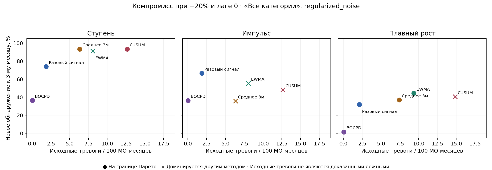

# Как выбирать детектор: срок, нагрузка и форма изменения

[Индекс исследований](../README.md) · [BOCPD](BOCPD_REPORT.md) · [Пакет сдачи](../SUBMISSION.md)

## Что добавлено

Построена карта компромиссов пяти методов из **одного сопоставимого** опыта BOCPD: одинаковые февраль–июнь калибровки и q99, «Все категории», regularized_noise, ±20%, ступень/импульс/плавный рост, гипотетические лаги 0/1/2. Каждый показатель — среднее десяти назначений МО. Это 90 исходных строк; два срока обнаружения дают 180 строк карты. Порог и модели не переобучались.

Для каждой формы, знака, лага и срока сравниваются две величины:

- доля назначенных МО с **новой** тревогой changed AND NOT original к первому или третьему календарному месяцу;
- исходные контрольные тревоги на 100 **доставленных** МО-месяцев.

Метод доминируется, если другой имеет не большую нагрузку и не меньшую долю обнаружения, причём хотя бы одно неравенство строгое. Граница Парето оставляет варианты, между которыми нужен прикладной выбор. Она относится к указанному сценарию и этим двум метрикам; не оценивает все возможные свойства метода.



На рисунке +20%, лаг 0 и срок 3 месяца. Например, для ступени CUSUM и среднее 3 м округляются до 93,32%, но не равны:93,3246% против 93,3182%. CUSUM имеет на 0,0064 процентного пункта больше при примерно вдвое большей нагрузке; при точном сравнении оба остаются на границе Парето. По этим средним нельзя доказать значимость столь малой разности. Среднее 3 м доминирует EWMA в этом конкретном сценарии. Для плавного роста EWMA обнаруживает 44,37%, CUSUM40,46% и среднее 3 м 36,94%. Между EWMA и средним 3 м остаётся обмен чувствительности на нагрузку. Эти отношения не объявляются универсальными.

## Что меняет задержка публикации

Ниже минимум/максимум доли обнаружения к третьему месяцу по **шести сценариям**: два знака × три лага. Максимум нагрузки также взят по этим шести сценариям. Это диапазон средних, не доверительный интервал и не гарантия для новых данных. Минимум чувствительности и максимум нагрузки могут относиться к разным сценариям.

| Метод | Ступень: min–max | Импульс: min–max | Плавный рост: min–max | Максимальная нагрузка, ступень/импульс | Максимальная нагрузка, плавный рост |
|---|---:|---:|---:|---:|---:|
| Разовый сигнал | 66,46–92,29% | 66,46–87,86% | 0,66–37,78% | 1,86 | 2,13 |
| Среднее 3 м | 24,45–95,28% | 24,45–56,58% | 0,50–49,30% | 6,35 | 7,42 |
| EWMA | 54,54–95,04% | 54,54–79,06% | 1,20–56,95% | 8,07 | 9,36 |
| CUSUM | 42,89–95,09% | 42,89–74,49% | 1,08–52,95% | 12,65 | 14,85 |
| BOCPD | 36,40–48,70% | 36,40–48,70% | 0,16–1,40% | 0,042 | 0,050 |

При лаге 2 к третьему месяцу доступно только первое исходное наблюдение после начала изменения. Накопление трёх значений не успевает помочь. Поэтому разовый сигнал имеет наибольший минимум для ступени/импульса в этой сетке. У плавного роста первое значение мало, и ни один метод не обеспечивает здесь высокой минимальной чувствительности. При лаге 1/2 обнаружение в первый календарный месяц равно нулю по доступности данных.

**Практический вывод:** ускорение публикации данных — отдельный фактор качества. Заменой детектора нельзя восстановить ещё не опубликованное наблюдение.

## Иллюстрация ограниченной ёмкости проверки тревог

Применим к диапазонам условные лимиты 0,1 / 2 / 10 исходных тревог на 100 доставленных МО-месяцев и среди допустимых методов возьмём наибольшую минимальную чувствительность. Лимиты придуманы для иллюстрации; они не являются оценённой стоимостью ошибок или утверждённой ёмкостью команды.

| Лимит | Ступень/импульс: вариант и минимум | Плавный рост: вариант и минимум |
|---:|---|---|
| 0,1 | BOCPD, 36,40% | BOCPD, 0,16% |
| 2 | Разовый сигнал, 66,46% | BOCPD, 0,16% |
| 10 | Разовый сигнал, 66,46% | EWMA, 1,20% |

Такой расчёт показывает, что допустимость по нагрузке сама по себе не обеспечивает полезной чувствительности. Например, лимит 2 исключает разовый сигнал для ramp: его максимальная нагрузка 2,13. Оставшийся BOCPD имеет минимум всего 0,16%. Корректный ответ при требованиях к чувствительности может быть «подходящего метода нет». Увеличивать лимит после просмотра таблицы и объявлять выбранный метод подтверждённым победителем нельзя.

## Правило для следующего независимого опыта

Это предложение процедуры, **ещё не проверенное на новом периоде**. Оно дополняет обсуждение и не изменяет замороженный [NEXT_HOLDOUT_PROTOCOL](../protocols/NEXT_HOLDOUT_PROTOCOL.md).

1. До получения новых расходов пользователь мониторинга задаёт категорию, территориальный охват, срок реакции D, приемлемую нагрузку B и минимальную чувствительность S. Если исторические события не размечены, B относится к общим/необъяснённым тревогам, а не к FPR. Если нет обоснованных B и S, готового решения о методе нет.
2. Разделить калибровочный и оценочный периоды. Настроить пороги и выбрать метод только на калибровочной части; учитывать фактические даты публикации, пропуски и цензурирование. Зафиксировать код, JSON, значения B/S/D и условия отказа до оценочного периода.
3. Из кандидатов, удовлетворяющих B и S на калибровке, выбрать лучший по заранее заявленной цели: например, обнаружение к D с одинаковыми знаменателями. Если кандидатов нет, отказаться от рекомендации. Разрешение точных равенств тоже записать заранее. Синтетическая чувствительность может дополнять оценку, но не заменяет реальные метки сдвига.
4. На оценочном периоде показать все пять методов и результат замороженного правила. Нельзя переназначать победителя по этой оценке. Десять синтетических назначений на одной истории не дают десять независимых временных тестов; неопределённость на новых данных требует достаточного числа независимых временных блоков.
5. Отдельно оценивать **предупреждение до шока**: признак известен до события, положительный lead time, пропуски и нагрузка. Таблица обнаружения после появления расходного сигнала не доказывает предупреждение заранее. Датированный эпизод МЧС сам по себе не является истинной меткой структурного сдвига расходов.

## Воспроизведение и границы

```bash
python tools/detector_tradeoffs.py
python tools/detector_tradeoffs.py --verify
```

Скрипт читает сохранённую сопоставимую таблицу, не обучает модели и не входит в основную refresh-сборку. Результаты приложения находятся в [reports/detector_tradeoffs](../../reports/detector_tradeoffs/):180 строк границ,15 диапазонов,9 иллюстраций лимитов, PNG/SVG и [audit.json](../../reports/detector_tradeoffs/audit.json) с SHA256 источника, кода и настроек. Старые 201 результат/29 научных пар сохраняются; рисунок приложения считается отдельно.

Исходные контрольные тревоги не доказаны ложными. Они считаются на иной группе, чем назначенные МО; их нельзя превращать в precision или ожидаемую денежную стоимость пропуска. Форма/знак реального будущего изменения неизвестны. Рассмотрена одна категория и один способ масштабирования; для остальных действует исходное полное сравнение. Уже изученный 2024, пять месяцев калибровки порога (шесть для масштаба) и гипотетические винтажи ограничивают выводы. Основной метод проекта этим приложением не переопределяется.
