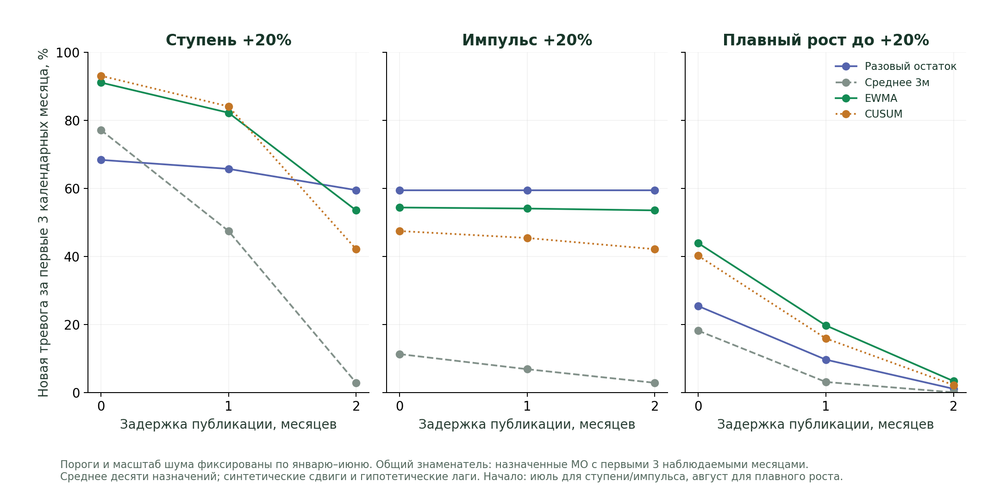

# Когда тревога действительно доступна: публикационная задержка

## Исследовательский вопрос

Сравнение по исходному месяцу расходов показывает, насколько быстро реагирует алгоритм после получения очередной точки. Пользователю важен **календарный срок доступности тревоги**. Если июльский расход публикуется в августе, июльскую тревогу нельзя считать доступной в июле.

[Протокол](../protocols/DETECTOR_DELAY_EXPERIMENT.md) записан до нового расчёта. Это расширение прежнего as-of опыта, без нового выбора метода или порогов. Основной прогноз и протокол следующей независимой истории сохранены.

## Метод

Шесть категорий, четыре детектора (разовый остаток, среднее 3 месяца, EWMA, CUSUM), два масштаба сигнала: исходный и прежний регуляризованный масштаб шума. Когорта определяется только по полноте января 2023 — июня 2024. Для «Все категории» это 2024 МО. Калибровка январь–июнь: 99-й перцентиль максимального балла каждого МО; значения совпадают с прежним опытом.

Использованы десять прежних ID-стабильных назначений примерно четверти МО, воздействия ±20%: ступень, импульс, плавный рост. Начало ненулевого воздействия — июль для ступени/импульса и август для плавного роста. Преобразование сигнала, последовательные состояния и политика пропусков не изменены. При отсутствии источника балл не наблюдаем; EWMA/CUSUM сбрасываются. Результаты всех сочетаний сохранены: 8640 строк.

Гипотетическая задержка 0/1/2 месяца одинакова для всех МО и источниковых месяцев. Параметры готовы после получения июня: в конце июня/июля/августа. Первый июльский сигнал становится доступен в конце июля/августа/сентября. Алгоритм проходит исходные месяцы в прежнем порядке; равномерный лаг меняет календарное время получения, не баллы или пороги. Пересмотр данных и неодинаковые сроки прихода не моделируются.

Тревога, приписываемая воздействию, определяется попарно: изменённая тревога AND NOT исходная в том же МО и источниковом месяце. Это синтетическая атрибуция; реальные события или реальные ложные тревоги она не размечает.

## Знаменатели и конец оценки

Основная доля обнаружений за первые 1/2/3 календарных месяца считается среди назначенных МО с полностью наблюдаемыми первыми тремя источниковыми месяцами воздействия. Знаменатель фиксирован для всех задержек/методов. В таблицах представлены назначенные, оценённые и исключённые из-за пропусков МО. Для ступени +20% в среднем по десяти назначениям это 501 назначенный МО, 499,6 оценённых, 1,4 с неполным окном. Дробные числа — среднее назначений, не дробные муниципалитеты.

Конец календарной оценки — декабрь 2024. Опубликованные позже тревоги не засчитываются к этому сроку. Для всех 2024 МО по «Все категории» исходное второе полугодие содержит 12130 наблюдаемых МО-месяцев и 14 пропусков. При лаге 1 к декабрю доступны 10112 наблюдений, ещё 2018 ожидают публикации; при лаге 2 — 8088 и 4042. Ожидание публикации не является отсутствующим исходным фактом.

Все показатели обнаружения к декабрю и условные медианы относятся к той же когорте с полным первым трёхмесячным окном. Условная медиана календарной задержки сопровождается числом и долей обнаружений к декабрю. Для сводки условные медианы усредняются по назначениям, а не объединяются в одну медиану всех МО. Уменьшение числа поздних обнаружений из-за правого цензурирования может изменить состав этой статистики.

## Результаты: фиксированный масштаб шума, +20%, «Все категории»

Доля новых тревог за первые **три календарных месяца** от первого ненулевого месяца, %; среднее десяти назначений. Не доверительный интервал и не десять независимых временных историй.

| Воздействие | Метод | Лаг 0 | Лаг 1 | Лаг 2 |
|---|---|---:|---:|---:|
| Ступень | Разовый остаток | 68,40 | 65,75 | 59,51 |
| Ступень | Среднее 3 м | 77,20 | 47,50 | 2,86 |
| Ступень | EWMA | 91,13 | 82,25 | 53,55 |
| Ступень | CUSUM | 93,12 | 84,11 | 42,14 |
| Импульс | Разовый остаток | 59,51 | 59,51 | 59,51 |
| Импульс | Среднее 3 м | 11,31 | 6,87 | 2,86 |
| Импульс | EWMA | 54,39 | 54,09 | 53,55 |
| Импульс | CUSUM | 47,48 | 45,44 | 42,14 |
| Плавный рост | Разовый остаток | 25,44 | 9,68 | 1,10 |
| Плавный рост | Среднее 3 м | 18,20 | 3,11 | 0,06 |
| Плавный рост | EWMA | 43,93 | 19,73 | 3,37 |
| Плавный рост | CUSUM | 40,23 | 15,92 | 2,20 |



При двухмесячной задержке преимущество накопительных методов для ступени в трёхмесячном сроке исчезает: доступна лишь первая источниковая точка после начала воздействия. При месячной задержке их преимущество ещё сохраняется в этой синтетической постановке. При любом положительном лаге обнаружений в первом календарном месяце нет: источник ещё не поступил.

Одинаковые 59,51% для импульса у разового остатка не означают нулевую задержку: эта тревога поступает через 0/1/2 месяца и во всех трёх сценариях укладывается в трёхмесячный срок. Более поздние накопительные тревоги после окончания импульса не являются обнаружением до начала события.

## Нагрузка тревогами и практическое применение

Для ступени +20% при лаге 0 новые парные контрольные тревоги на 100 полученных наблюдаемых МО-месяцев: разовый остаток 0,335, среднее 3 м 0,449, EWMA 2,104, CUSUM 4,305. При лаге 2 — 0,194/0,252/1,357/2,018. Снижение не доказывает улучшение специфичности: к декабрю доступен более короткий и иной по месяцам участок. Эти тревоги не названы реальными ложными тревогами. Подробные исходные и новые нагрузки раскрыты для всех категорий, направлений и масштабов.

Практическое правило для проекта: отдельно сообщать месяц расхода, предполагаемый месяц его публикации и месяц доступности тревоги. Выбор детектора должен учитывать требуемый календарный срок и компромисс с нагрузкой тревогами. Высокая источниковая чувствительность накопительного метода сама по себе не подтверждает раннее предупреждение пользователя.

В этом опыте нет прогнозирования будущего шока до появления наблюдения. Новостное предупреждение потребовало бы собственной честной проверки публикаций, покрытия и точности; его преимущество здесь не измерено. Текущий опыт не назначает новый «лучший» метод по уже просмотренному архиву.

## Проверки и воспроизводимость

```bash
PYTHONPATH=src python -m sberindex.detection.detector_delay_audit
PYTHONPATH=src python -m sberindex.detection.detector_delay_audit --verify
```

Четыре CSV: `detector_delay_runs`, `summary`, `coverage`, `calibration`; JSON `detector_delay_protocol`. Сырой источник, экспериментальный протокол и четыре исполняемых модуля защищены SHA256. Проверка требует полного набора хешированных входов, пересчитывает все 8640 строк и таблицы, сверяет прежние пороги и нулевые трёхмесячные доли, проверяет монотонность обнаружения по лагу. При лаге 1 трёхмесячная календарная доля равна двухмесячной источниковой, при лаге 2 — одномесячной, на тех же оценённых МО.

Три теста защищают перенос июльской тревоги в август, правое цензурирование декабря и общий знаменатель с пропусками. Проверка другим ассистентом не выявила ошибок календарного совмещения; это не независимая научная экспертиза.

Ограничения: изученный архив 2024, синтетические воздействия, мало калибровочных месяцев, одинаковые гипотетические лаги, неизвестные реальные винтажи, отсутствие независимых меток смены расходов. Ни победа в конкурсе, ни эксплуатационная точность отсюда не следуют.

Итог календарного аудита детекторов: 44 этапа refresh, 42 проверки и 20 unit-тестов прошли. Переносная пересборка за 277,11 с восстановила 190/190 производных результатов, 27 PNG и 27 SVG побайтно; 22 кэшированных входа не изменились. Исходники совпадают с записанными хешами. Та же установленная Python-среда и сохранённые прогнозы, не чистая установка, полное переобучение или новый независимый временной тест.
