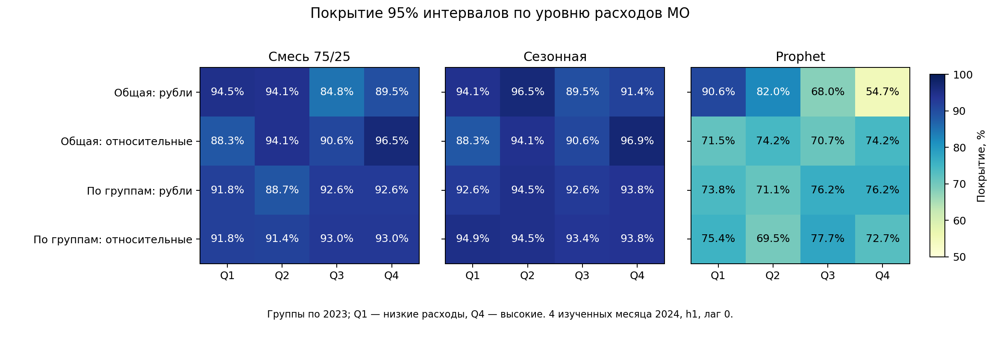

# Прогнозные интервалы для разных групп муниципалитетов

[Протокол](../protocols/GROUPED_INTERVAL_EXPERIMENT.md) · [Конфигурация](../../configs/grouped_intervals.json) · [Предыдущее сравнение](INTERVAL_CALIBRATION_REPORT.md).

## Исследовательский вопрос

Общее нормирование улучшило покрытие смеси в среднем, но снизило его у дешёвых МО. Проверили, помогает ли отдельная калибровка по квартилям среднего расхода 2023. Каждая группа содержит 64 МО; границы/назначения фиксированы до расчёта её интервалов и сохранены в groups.csv. Деление по ошибкам 2024 не выполнялось.

Три модели, два номинальных уровня 80/95%, одинаковые факты/точечные прогнозы/ID/цели. Начальная калибровка июль–август, окно последних 3 м, цели сентябрь–декабрь 2024, h1, предположение лага 0. По сравнению с предыдущим опытом меняется только выборка для квантиля: все 256 МО или 64 МО своей группы. Два варианта ошибки: в рублях и относительно прогноза. Размер группы и параметры не подбирались по результатам.

**Гипотеза возникла после изучения предыдущих ошибок на том же 2024. Это исследовательское продолжение, не независимая проверка.**

## Результаты для смеси, номинал 95%

| Калибровка | Общее покрытие | Минимум по квартилям | Худший месяц | Средняя ширина, руб. | Interval score, руб. |
|---|---:|---:|---:|---:|---:|
| Общая, рубли |90,72%|84,77%|87,11%|4055,16|7883,71|
| Общая, относительная |92,38%|88,28%|88,67%|4867,19|7403,63|
| По квартилям, рубли |91,41%|88,67%|88,28%|4367,33|7524,07|
| По квартилям, относительная |92,29%|91,41%|86,72%|4769,18|7393,97|

Раздельное относительное нормирование увеличило минимальное квартильное покрытие с 88,28% до 91,41% относительно общего нормирования. Средняя ширина снизилась примерно на 2,0%; общее покрытие слегка уменьшилось (−0,10 п.п.), а худший месяц ухудшился на 1,95 п.п. Разность intervalscore около 0,13% не считается значимым преимуществом. Метод выравнивает групповые средние, но не улучшает каждую временную дату.

По сравнению с исходными общими интервалами в рублях квартильная калибровка в рублях повысила общее покрытие на 0,68 п.п. и минимум по квартилям на 3,91 п.п.; ширина выросла на 7,7%, intervalscore снизился на 4,56%. Ни один вариант смеси не достиг 95% в среднем.

## Покрытие по квартилям

| Метод | Q1: низкие расходы | Q2 | Q3 | Q4: высокие расходы |
|---|---:|---:|---:|---:|
| Общий относительный |88,28%|94,14%|90,63%|96,48%|
| Раздельный относительный |91,80%|91,41%|92,97%|92,97%|

Q1 восстановился с 88,28% до 91,80%, но остался ниже 94,53% исходной общей калибровки в рублях. Q2/Q4 теряют покрытие относительно общего нормирования. Поэтому нельзя утверждать, что новая процедура улучшает качество для каждого МО или каждой группы. Минимум по квартилям является описательным критерием; не статистической гарантией защиты отдельного жителя/муниципалитета.

На 80% для смеси раздельный относительный метод даёт покрытие 71,29%, ширину 2386,49 руб., score4699,01 руб.; общий относительный —71,97%,2660,96 руб.,4851,14 руб. Выигрыш ширины/штрафа сопровождается небольшой потерей общего покрытия; минимум по квартилям повышается с 57,42% до 68,36%. До 80% средний результат также не доходит.

## Сезонный ориентир и отрицательные результаты

У сезонной модели при 95% раздельное относительное нормирование даёт 94,14% покрытия, минимум квартилей 93,36%, ширину 4579,78 руб. и score6890,24 руб. Общий относительный вариант:92,48%, минимум 88,28%,4992,19 руб.,7021,32 руб. Но относительно старого общего варианта в рублях (92,87%,4072,77 руб.) ширина увеличивается на 12,4%.95% не достигнуты. Это аргумент сохранять сезонную модель в качестве сильного ориентира; статистический выбор победителя не сделан.

Для Prophet групповые процедуры не устраняют недопокрытие. Все его результаты сохранены в сводке и на рисунке, без исключения неудачных методов.

## Ограничения и решение

Калибровка в квартиле содержит 128 или 192 строк, но только 2/3 общих календарных месяца. Зависимость МО, сезонность и сдвиги во времени сохраняются; формальное условное покрытие группы не доказано. Назначения групп зависят только от 2023 внутри неизменённой оценочной когорты; это не снимает ограничений её исходного отбора и повторного изучения 2024. Другие горизонты и реальный лаг публикации здесь не проверялись.

**Рабочую калибровку не заменяем на основании этого изученного окна.** Сохраняем фиксированный групповой метод как кандидата следующей проверки: сравнивать общий/групповой варианты нужно одновременно по покрытию, ширине, штрафу и худшей группе/дате. Протокол независимого теста не менялся. Проект не публиковался и заявка не отправлялась.

## Код, таблицы и повторение

```bash
PYTHONPATH=src python -m sberindex.forecasting.grouped_intervals
PYTHONPATH=src python -m unittest discover -s tests
```

Отдельное приложение вне основного 51-этапногоrefresh. Повторно используется проверенный calibrate_panel; прежний модуль и его результаты не изменены. Три новых теста проверяют изоляцию групп, защиту границ от текущих/будущих фактов и отказ при отсутствующей группе. Контроли совпадают с предыдущим приложением на каждой строке, а не только по средним.

[Сводка](../../reports/grouped_intervals/summary.csv) · [Квартили](../../reports/grouped_intervals/quartiles.csv) · [Каждый месяц/квартиль](../../reports/grouped_intervals/group_monthly.csv) · [Границы/назначения групп](../../reports/grouped_intervals/groups.csv) · [Квантили и даты калибровки](../../reports/grouped_intervals/calibration.csv) · [SHA256](../../reports/grouped_intervals/audit.json).



Подтверждение:51 тест прошёл в основной и ранее установленной чистой среде.10 файлов приложения побайтно воспроизведены из/tmp;330 защищённых файлов неизменны относительноf75b49c. Проверены 24576 интервалов,240 калибровок,24 сводки и 256 назначений групп. [Отдельный журнал проверки](../../reports/grouped_intervals/verification.json). Полныйrefresh/переобучение тяжёлых моделей не выполнялись.
