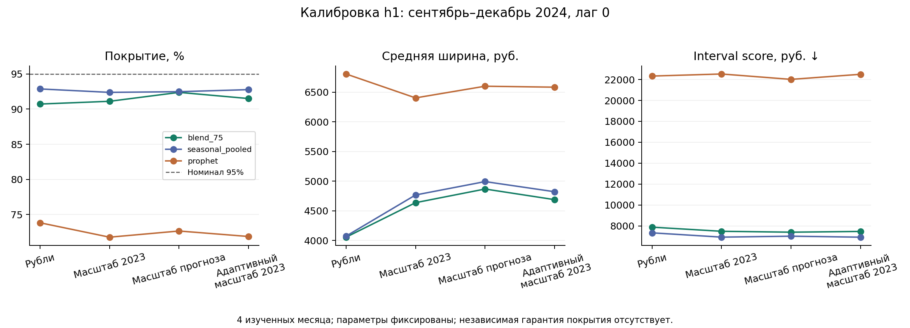

# Калибровка прогнозных интервалов

[Протокол](../protocols/INTERVAL_CALIBRATION_EXPERIMENT.md) · [Настройки](../../configs/interval_calibration.json) · [Сила доказательств](STATISTICAL_EVIDENCE_REPORT.md).

## Что проверяли

Недопокрытие интервалов не устраняется одной высокой точностью среднего прогноза. Мы сравнили четыре фиксированных метода на одних точечных прогнозах трёх моделей: Prophet, сезонной и смеси 75/25. Все интервалы для текущей цели используют только ошибки предшествующих месяцев; масштаб 2023 не зависит от данных 2024. Для адаптации обратная связь текущего месяца влияет только на следующий месяц.

Окно: четыре уже изученных месяца, сентябрь–декабрь 2024,256 МО, h1, гипотетический лаг 0. Это не новые независимые факты и не проверка рабочего лага 1. Сохранили прежние прогнозы, факты и настройки моделей. Старый контроль raw_3m совпал с исходными online_interval_summary до численной точности.

## Результат для смеси

Номинальный уровень 95%; фактическое покрытие — доля попаданий с равным весом четырёх месяцев. Interval score учитывает и ширину, и штраф за выход факта за границы; меньше лучше.

| Калибровка | Покрытие | Худший месяц | Средняя ширина, руб. | Interval score, руб. |
|---|---:|---:|---:|---:|
| Ошибки в рублях, последние 3 м |90,72%|87,11%|4055,16|7883,71|
| Нормирование на среднее 2023 |91,11%|86,33%|4636,92|7489,99|
| Нормирование на текущий прогноз |92,38%|88,67%|4867,19|7403,63|
| Адаптивное нормирование на 2023 |91,50%|86,72%|4687,89|7475,48|

Нормирование на прогноз увеличило покрытие на 1,66 п.п., снизило interval score на 6,09%, но расширило интервал примерно на 20,0%. В декабре покрытие выросло с 87,50% до 90,63%. **Номинальные 95% не достигнуты**. Это умеренное улучшение исследовательского сценария, не гарантия будущего покрытия.

Для 80% интервалов нормирование на прогноз увеличивает покрытие с 67,58% до 71,97%, однако interval score ухудшается с 4790,98 до 4851,14 руб. Расширение интервала не всегда оправдано: положительный результат 95% не переносится автоматически на 80%.

## Для кого меняется качество

Квартили фиксируются по средним расходам 2023 на той же когорте, по 64 МО в каждой. Покрытие 95% интервалов смеси:

| Метод | Q1: низкие расходы | Q2 | Q3 | Q4: высокие расходы |
|---|---:|---:|---:|---:|
| Рубли |94,53%|94,14%|84,77%|89,45%|
| Масштаб прогноза |88,28%|94,14%|90,63%|96,48%|

Минимальное групповое покрытие увеличилось, но Q1 потерял 6,25 п.п. Нормирование перераспределяет ширину к дорогим МО и не обеспечивает одинаковую защиту каждой территории. Поэтому мы показываем групповые результаты и не называем метод универсально лучшим.

Сезонный ориентир с прежними интервалами в рублях имеет покрытие 92,87%, ширину 4072,77 руб., score7342,60 руб. Это лучше общего покрытия/ширины нормированной смеси. Для самой сезонной модели нормирование на прогноз уменьшает покрытие до 92,48%, увеличивает ширину до 4992,19 руб., хотя score снижается до 7021,32 руб. Результат зависит от модели и критерия; новый победитель не выбирается по удобному срезу.

## Адаптация и ограничения

Идея регулировать уровень по предыдущим ошибкам мотивирована [Gibbs и Candès, 2021](https://arxiv.org/abs/2106.00170). Наш вариант обновляется по средней доле промахов всего месяца, использует нормированные панельные ошибки, ограничивает alpha и имеет короткое скользящее окно. Это модифицированная эвристика: теоремы исходного ACI не переносим на неё. gamma=.05 и границы alpha зафиксированы до новых расчётов; поиск значений не выполнялся.

Ни один метод не достиг 95% для смеси; все результаты зависят от четырёх общих календарных дат. Муниципалитеты не считаются независимыми временными повторениями. Нет p-values, доказательства условного покрытия каждого МО или оценки новых лет. Исходный рабочий выпуск не изменён; для выбора новой калибровки нужны новые данные и подтверждённая задержка публикации.

## Воспроизведение и проверки

```bash
PYTHONPATH=src python -m unittest discover -s tests
PYTHONPATH=src python -m sberindex.forecasting.interval_calibration
```

Отдельное приложение, не новый этап основного 51-этапного refresh. Пять новых тестов проверяют защиту от будущих/текущих фактов, совпадение старого контроля, порядок адаптивного обновления, отказ при отсутствующем масштабе/дубликатах и отсутствующем калибровочном месяце. SHA256 входов, исходников, протокола, настроек и выходов в audit.json.

[Сводные результаты](../../reports/interval_calibration/summary.csv) · [Каждый месяц](../../reports/interval_calibration/monthly.csv) · [Квартили](../../reports/interval_calibration/quartiles.csv) · [Хронология калибровки](../../reports/interval_calibration/calibration.csv) · [Проверки и хеши](../../reports/interval_calibration/audit.json).



Проверено:48 тестов в основной и ранее установленной чистой среде; восемь файлов приложения побайтно воспроизведены из/tmp,318 защищённых файлов неизменны. [Отдельное подтверждение](../../reports/interval_calibration/verification.json). Полныйrefresh и тяжёлые модели в этом цикле повторно не запускались.
