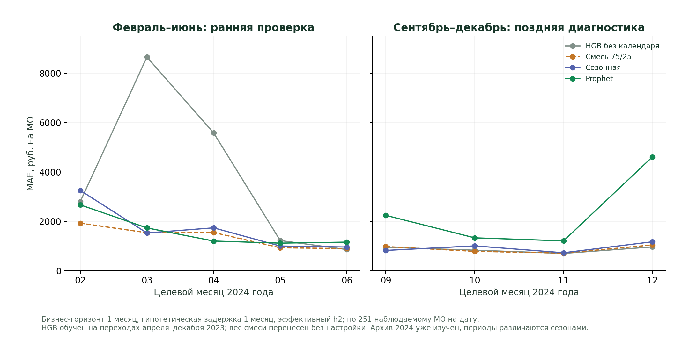

# Ранняя проверка прогноза при месячной задержке

## Зачем выполнен эксперимент

В поздней диагностике сентября–декабря 2024 HGB без календаря имел MAE 862,75 руб. против 880,32 руб. у прежней смеси. Прежде чем обсуждать замену модели, проверено, поддерживает ли ранняя история это небольшое преимущество в **том же сценарии задержки**. Протокол [OPERATIONAL_EARLY_EXPERIMENT.md](../protocols/OPERATIONAL_EARLY_EXPERIMENT.md) записан до расчёта новых прогнозов. Параметры HGB, выборка и вес смеси не настраивались.

**Результат:** ранняя история не поддерживает замену смеси на HGB. Это содержательное уточнение обоснования выбора модели, не улучшение заявленной MAE через новый подбор.

## Хронология и модели

В конце месяца t требуется прогноз расходов за t+1. Последний видимый факт в гипотетическом сценарии — t−1, поэтому нужны два шага прогноза. Например, для февраля 2024 решение принимается в конце января, последняя точка — декабрь 2023. HGB прогнозирует январь и затем февраль: фактический январь не подставляется в промежуточный шаг. Prophet обучается только до последней видимой точки.

- HGB: глобальное обучение только по 2075 полным положительным рядам 2023 года; 18675 переходов, целевые месяцы апреля–декабря. Три лага логарифма расходов и синус/косинус месяца; конфигурация прежняя.
- Сезонный ориентир: последнее известное значение умножается на отношение сезонных факторов целевого и последнего видимого месяцев. Общий профиль рассчитан только по 2023 году.
- Prophet: отдельная модель для каждого допустимого МО, без годовой/недельной/дневной сезонности; отрицательный прогноз обрезается на нуле, как в прежнем сравнении.
- Смесь: 75% сезонного ориентира + 25% Prophet. Вес перенесён из прежнего раннего h1-сравнения, **не выбран заново по h2**.

Ранние цели: февраль–июнь 2024, пять дат. Поздние: сентябрь–декабрь, четыре даты, точное переиспользование прежних прогнозов. Повторно обученный HGB воспроизвёл поздние прогнозы с относительным допуском 1e−10. Июль и август не добавлены в выбор модели задним числом.

## Покрытие и парность

Исходные 256 ID выбраны по полноте 2023 года. Для первой цели прогноз рассчитан для всех 256 МО с доступной историей; затем пять отсутствующих фактов февраля исключены **только из оценки**, без замены или нулевого заполнения. Для следующих дат полная видимая история остаётся у 251 МО. На каждой оценочной дате у всех четырёх моделей строго одинаковые 251 пары и факты: 1255 на раннем отрезке, 1004 на позднем. Эти числа получены из правил доступности, а не назначены по будущей полноте всего 2024 года. Подробности — `results/operational_early_coverage.csv`.

MAE сначала усредняется по МО внутри даты, затем по датам с одинаковым весом. Здесь pooled MAE совпала, поскольку число наблюдений на каждой дате одинаковое. R² рассчитан по всем парам периода: он отражает в том числе различия масштаба между МО и не является мерой точности внутри каждого временного ряда. WAPE и нормирование к средним расходам МО в 2023 году раскрыты отдельно.

## Результаты

| Модель | Ранняя MAE, руб. | Поздняя MAE, руб. | Ранний pooled R² | Поздний pooled R² |
|---|---:|---:|---:|---:|
| Смесь 75/25 | 1368,85 | 880,32 | 0,9788 | 0,9891 |
| HGB без календаря | 3823,78 | 862,75 | 0,8030 | 0,9909 |
| Prophet | 1576,56 | 2348,63 | 0,9634 | 0,9445 |
| Сезонная | 1695,87 | 932,36 | 0,9644 | 0,9882 |

На ранних датах HGB хуже смеси в четырёх из пяти месяцев и по средней ошибке каждого из 251 МО. Разность MAE HGB − смесь: +2454,93 руб. Исключение каждой отдельной даты сохраняет проигрыш: +1290,28…+3078,51 руб. Самая большая месячная ошибка HGB — март, 8652,22 руб.; даже без марта преимущество смеси сохраняется.

Смесь лучше сезонной модели на раннем отрезке на 327,02 руб., в четырёх из пяти дат и по средним ошибкам 234 из 251 МО. При исключении каждой даты разность остаётся отрицательной: −411,18…−77,57 руб. Это анализ чувствительности, не доверительный интервал.

На позднем отрезке HGB лучше смеси всего на 17,58 руб. При этом средняя ошибка ниже у 125 МО и выше у 126. Без декабря разность меняет знак на **+2,85 руб.** Следовательно, даже поздний выигрыш не равномерный и зависит от состава оценочных дат.



## Что найдено и как использовать

Для этого архива фиксированная смесь переносится на ранний h2-сценарий лучше HGB и имеет более убедительное обоснование для сохранения прежнего решения. Поздний минимум HGB нельзя использовать как достаточное основание для его назначения основной моделью. Результаты подсказывают проверять календарную переносимость и устойчивость к отдельным месяцам до смены модели.

Нельзя приписать разницу доказанному структурному сдвигу: ранние и поздние месяцы различаются сезонами, доступной длиной истории и динамикой расходов. Обучающие переходы HGB не содержат января–марта, но один этот факт не доказывает причину ошибок. Для проверки причины понадобятся дополнительные годы или заранее ограниченная абляция на новой истории.

## Воспроизводимость и ограничения

Результаты: `operational_early_predictions.parquet`, `operational_early_protocol.json`, `operational_early_runtime.csv`; пять производных CSV `summary`, `monthly`, `paired`, `sensitivity`, `coverage`. Источники, экспериментальный протокол, исполняемый модуль и используемые вспомогательные модули защищены SHA256. Проверка требует полного набора ключей манифестов, пересчитывает метрики, сверяет факты с исходными данными и поздние прогнозы с прежним кэшем.

```bash
PYTHONPATH=src python -m sberindex.forecasting.operational_early_audit
PYTHONPATH=src python -m sberindex.forecasting.operational_early_audit --verify
PYTHONPATH=src python -m sberindex.forecasting.operational_early_audit --refresh
```

Первый запуск обучает HGB и ранние Prophet. `--refresh` пересчитывает таблицы из сохранённых прогнозов. Тесты защищают отсечение будущего в обучении, неизвестный промежуточный январь, арифметику сроков и отказ от неполного манифеста.

**Архив 2024 уже изучен многократно. Ранняя проверка ретроспективная и не является новым независимым тестом.** Реальные исторические даты публикации расходов и винтажи не восстановлены; месячная задержка гипотетическая. Основная модель и [протокол следующей независимой истории](../protocols/NEXT_HOLDOUT_PROTOCOL.md) не изменены. Финальная презентация доступна в `artifacts/presentation.pdf`.

Финальная проверка раннего h2-аудита: 43 этапа refresh, 41 проверка и 17 unit-тестов прошли. Переносная пересборка за 171,39 с восстановила 185/185 производных результатов, 26 PNG и 26 SVG побайтно; 22 сохранённых входа остались неизменными. Код-хеши актуальны. Проверка использует ту же установленную среду и кэш прогнозов; это не полное переобучение и не независимый временной тест.
