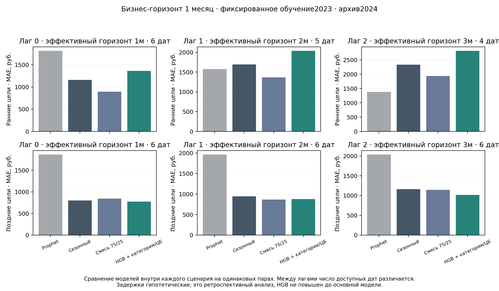

# Рабочий прогноз, задержки данных и прикладной выбор детектора

[Протокол](../protocols/OPERATIONAL_WORKFLOW.md) · [Конфигурация](../../configs/operational_workflow.json) · [Код](../../tools/operational_workflow.py)

## Что проверено

Остаточные HGB own/categories/policy с прежними гиперпараметрами обучены на 2023. Зарплатный снимок 2026 исключён из рабочего кандидата. Проверены лаги 0/1/2 и бизнес-горизонты 1/3/6/12: последний расходный месяц = решение−лаг, эффективный горизонт = бизнес-горизонт+лаг. Prophet обучается на допустимой истории; сезонный профиль и когорта 256 ID зафиксированы по 2023. Категориальные пропуски остаются NaN; будущие расходы и решения ЦБ отсутствуют в признаках. ЦБ консервативно ограничен последним расходным месяцем; это может терять доступные новости текущего месяца, но сохраняет прежнее определение признаков.

Новое окно охватывает **все допустимые цели 2024**, ранние — январь–июнь, поздние — июль–декабрь. Это шире прежних отдельных опытов; их MAE нельзя непосредственно сравнивать с новым усреднением. Все шесть моделей внутри сценария имеют одинаковые ID/даты. MAE сначала усредняется по МО, затем по месяцам. R², индивидуальные прогнозы, парные разности и исключение по одной дате сохранены рядом с таблицей покрытия. Архив 2024 уже многократно исследован; это не независимая проверка.

## Результаты задержанного сравнения

MAE, руб.; смесь — .75 сезонного прогноза + .25 Prophet. Таблица не выбирает лучшую задержку: истинные даты публикации расходов неизвестны.

| Бизнес-горизонт | Лаг | Цели | Сезонный | Смесь 75/25 | HGB+категории/ЦБ |
|---:|---:|---|---:|---:|---:|
|1|1|ранние|1695,87|1368,85|2039,23|
|1|1|поздние|947,97|869,03|878,47|
|1|2|ранние|2337,61|1937,03|2818,06|
|1|2|поздние|1163,33|1146,56|1017,96|
|3|1|ранние|2974,09|2333,82|3544,71|
|3|1|поздние|1190,72|1179,92|1144,24|
|3|2|ранние|3589,15|2710,18|4008,91|
|3|2|поздние|1279,28|1301,68|1424,68|
|6|1|поздние|2026,35|1664,11|2181,82|
|6|2|поздние|2134,42|1546,02|2322,53|

На основном сценарии лаг 1 HGB+ЦБ проигрывает смеси на ранних и поздних h1, ранних h3 и h6; небольшое улучшение позднего h3 не оправдывает общего повышения. При лаг 2 поздний h1 выигрывает, но ранние даты и длинные горизонты ухудшаются. Поэтому новая HGB остаётся исследовательским сравнением, её не выбираем по удобному срезу. Признаки ставок общие для всех МО: множество муниципальных строк не увеличивает число независимых макроэкономических наблюдений. Парная абляция оценивает прогнозное качество, причинный эффект ставки не установлен.

Количество оценочных ID-месяцев **на одну модель**:

| Лаг | h1 | h3 | h6 | h12 |
|---:|---:|---:|---:|---:|
|0|3012|2510|1758|252|
|1|2761|2259|1507|0|
|2|2510|2008|1256|0|

Для h12 с лагом 1/2 обучающий декабрь 2023 становится доступен слишком поздно, и допустимые цели попадают в 2025. Отсутствие оценки не заменено обучением на будущем. Для h12 лаг 0 лишь одна целевая дата; остаточная HGB экстраполирует за обучающий диапазон h1–h9.



[Все MAE/R²](../../reports/operational_workflow/summary.csv) · [Покрытие и причины исключения](../../reports/operational_workflow/coverage.csv) · [Парные разности](../../reports/operational_workflow/paired.csv) · [Чувствительность к датам](../../reports/operational_workflow/sensitivity.csv)

## Исполняемый выпуск

Единый инженерный кандидат использует смесь 75/25 на h1/3/6/12, лаг 1 по умолчанию. Перенос веса на все горизонты **не означает доказанный оптимум**, особенно для h12; прежнее сравнение HGB на h12 остаётся отдельным. Профиль заморожен на 2023, Prophet обучается на доступной истории; новые HGB в выпуск не входят. На раннем h3 при лаге 1 Prophet имеет MAE1722,93, смесь —2333,82: единый перенос веса не адаптирует режим и не гарантирует преимущества на каждом срезе. Модель не интерполирует неизвестные расходы и отказывается при пропуске/неположительном значении истории. Гиперпараметры и рабочие требования читаются из JSON.

```bash
python tools/operational_workflow.py --decision 2024-12 --lag 1 --output forecast.csv
# Для новой сопоставимой истории с неизменённым 2023:
python tools/operational_workflow.py --decision 2025-02 --lag 1 --input history.parquet --output forecast.csv
```

Вход новой истории: колонки territory_id, date (YYYY-MM), value; при наличии category берётся «Все категории». Полный ряд с 2023, те же единицы и определение показателя. Дубликаты и изменение обучающего 2023 отвергаются; пропуски не заполняются. Сопоставимость источника и фактические даты доступности проверяются по [независимому протоколу](../protocols/NEXT_HOLDOUT_PROTOCOL.md), CLI сам не доказывает доступность файла. Для внешнего входа записывается SHA256/provenance рядом с CSV.

Демонстрационный выпуск в конце декабря 2024 использует расходы не позднее ноября и выдаёт цели январь/март/июнь/декабрь 2025. [CSV](../../reports/operational_workflow/forecast_release.csv):1024 строки,1004 допустимых прогноза и 20 явных отказов (5 ID×4 горизонта). Это выпуск кандидата, **не подтверждённые факты 2025 и не оценка качества на 2025**.

## Прикладной детектор

Зафиксированы инженерные предположения: общие расходы, local regularized_noise, задержка 1, ступень±20%, срок 3 календарных месяца, минимум 50% новых обнаружений и не более 2 исходных тревог на 100 доставленных МО-месяцев. Исходные тревоги не размечены как ложные. Это пример допустимого рабочего профиля, а не оценка реальной цены ошибки.

Метод выбирается по первым пяти назначениям синтетического воздействия; оставшиеся пять не участвуют в выборе. Пороги и параметры исходного BOCPD-опыта не меняются. Сначала проверяются ограничения по худшему знаку шока, затем максимизируется минимальная чувствительность; ничья разрешается меньшей нагрузкой и названием. При отсутствии допустимого метода результат — отказ, без скрытого ослабления требований.

Выбран **spike**: на части выбора минимальная чувствительность 71,55%, максимальная нагрузка 1,70. На других назначениях —71,26% и 1,61; требования выполнены. BOCPD снижает нагрузку, но не достигает 50% чувствительности; накопительные методы чувствительнее, но превышают бюджет. При другом профиле требований нужен новый заранее зафиксированный выбор.

[Решение](../../reports/operational_workflow/detector_choice.json) · [Обе части](../../reports/operational_workflow/detector_partitions.csv).

Обе части используют те же изученные месяцы и МО 2024. Разделение назначений не создаёт независимых реальных событий или временного теста. Сигнал после публикации расходов является обнаружением, а не предсказанием будущего шока. У общего медианного компонента и локального остатка разные назначения; выбранный локальный метод не обнаруживает синхронный национальный скачок.

## Единый запуск и воспроизведение

Основной run_pipeline.py включает прежнюю ветку и исследовательские приложения: компромиссы, остаточные модели, задержанный опыт, выбор детектора, выпуск и научные рисунки. Результаты старых опытов не переименованы. Проверка новой установленной среды и перенесённого каталога отражается в workflow_clean_reproduction.json; тяжёлые основные Prophet/Chronos остаются объявленными кэшированными входами. Новый delayed Prophet и остаточные модели обучаются повторно. Финальная презентация собрана; проект не отправлен.

Итог проверки:51 этап успешно,43 теста в обеих средах. [Новая среда](../../reports/workflow_environment.json):64 версии совпали с lock. [Переносная сборка](../../reports/workflow_clean_reproduction.json):620,15 с,201/201 основных результатов,31 файл приложений и 29 пар PNG/SVG побайтно;22 кэшированных входа сохранены. [Пользовательский вход](../../reports/workflow_release_input_validation.json) воспроизвёл выпуск; изменённый 2023 отвергнут. [9036 общих строк](../../reports/workflow_reference_validation.json) согласуются с прежними ориентирами в численной точности.
