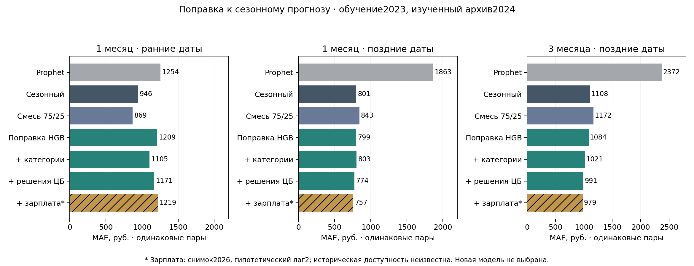

# Поправка к сезонному прогнозу: категории, решения ЦБ и зарплата

[Индекс исследований](../README.md) · [Новые источники](NEW_SOURCES_AUDIT.md) · [Протокол](../protocols/RESIDUAL_FEATURE_EXPERIMENT.md)

## Что проверено

Вместо прогноза уровня расходов с нуля модель учится корректировать сильный сезонный ориентир:

`прогноз = сезонный прогноз × exp(предсказанная логарифмическая поправка)`.

Обучающая цель — `log(факт / сезонный прогноз)`. Все расходы и целевые месяцы обучения находятся в 2023 году. Годовой сезонный профиль тоже оценивается на обучении 2023; обучающие переходы не выдаются за честную историческую проверку этого профиля.

Восемь фиксированных моделей: Ridge и HGB × четыре набора признаков. Гиперпараметры сохранены в [JSON](../../configs/residual_features.json), поиск по ошибкам 2024 не выполнялся. Поправка ограничена ±0,5 в логарифмическом масштабе до расчёта.

| Набор | Добавленные признаки |
|---|---|
| own | Последний общий уровень, два отношения нормированных прошлых расходов, изменчивость трёх последних значений, горизонт, календарная фаза цели |
| categories | Прошлые значения пяти категорий относительно общего уровня, их изменение за месяц и флаги отсутствия |
| policy | Известная к origin ключевая ставка и сумма изменений за последние три месяца, только после available_from |
| wage_snapshot | Национальная зарплата и её месячное изменение за origin−2; **снимок 2026, гипотетический лаг 2**, исторические винтажи неизвестны |

Категории не требуется суммировать до общих расходов: используются как признаки, а не полная бухгалтерская декомпозиция. Национальная зарплата — единый макроконтекст, не муниципальная зарплата. Будущие категории, будущие решения ЦБ и значения зарплаты после установленного среза не подставляются.

Каждая модель обучена на 93 375 пересекающихся переходах по 2075 МО, минимум три месяца истории, горизонты 1…9, целевые месяцы апреля–декабря 2023. Это много строк, но только девять обучающих целевых месяцев; повторные МО и горизонты не создают независимые годы. h12 — экстраполяция за диапазон обучения.

## Сопоставимые результаты

Все модели имеют одинаковые ключи МО/origin/цель/горизонт и факты. Поздние Prophet, сезонный прогноз и blend_selected сохранены точно. Ранние h1 взяты из исходной таблицы прогнозов; смесь 75/25 построена алгебраически. Её вес раньше выбирался по раннему окну, поэтому ранние строки не независимая валидация выбора смеси.

**MAE в рублях, сначала среднее по МО каждой даты, затем равный вес дат.** Ранние h1: февраль–июнь,5 дат; поздние h1: июль–декабрь,6; h3: сентябрь–декабрь,4; h6 и h12: одна декабрьская цель. Для h12 отсутствует сохранённая смесь, она не конструируется заново.

| Модель | h1 ранние | h1 поздние | h3 поздние | h6 | h12* |
|---|---:|---:|---:|---:|---:|
| Prophet | 1254,25 | 1863,47 | 2371,64 | 4332,79 | 2930,61 |
| Сезонный | 945,63 | 801,03 | 1108,47 | 1648,40 | 4853,75 |
| Смесь 75/25 | 868,77 | 843,08 | 1171,67 | 1247,45 | — |
| Ridge own | 1092,49 | 966,88 | 1141,67 | 1827,35 | 4985,15 |
| Ridge + категории | 1138,86 | 1001,10 | 1189,06 | 1897,29 | 5277,01 |
| Ridge + ЦБ | 1029,09 | 1362,92 | 1547,53 | 2392,56 | 4976,87 |
| Ridge + зарплата** | 1137,95 | 1134,95 | 1280,95 | 2192,34 | 3843,88 |
| HGB own | 1209,21 | 799,31 | 1083,88 | 1719,86 | 5123,33 |
| HGB + категории | 1105,26 | 803,41 | 1020,71 | 1695,44 | 5122,48 |
| HGB + ЦБ | 1171,13 | 773,93 | 991,12 | 1606,16 | 5199,28 |
| HGB + зарплата** | 1218,91 | 757,12 | 978,90 | 1595,03 | 5178,80 |

\*Новые поправки экстраполируют за обучающие горизонты; один месяц оценки. **Не подтверждённая исторически доступная абляция. PooledR², WAPE, число наблюдений и полная точность — в [summary.csv](../../reports/residual_features/summary.csv).



## Что добавляет каждый признак

Сравнение adjacent-абляций проводится на тех же парах; уменьшение MAE не доказывает причинный эффект признака.

- Категории уменьшают раннюю ошибку HGB на 103,95 руб. относительно own во всех пяти ранних месяцах, но результат 1105,26 всё ещё хуже сезонного 945,63. Поздний h1 слегка ухудшается (+4,11 руб.), поздний h3 улучшается (−63,17 руб.). Единого выигрыша на всех сроках нет.
- Добавление доступных решений ЦБ к категориям снижает позднюю MAEh1 на 29,48 руб. во всех шести датах и h3 на 29,59 руб. в трёх из четырёх. Но ранняя h1 ухудшается на 65,86 руб. Это полезный кандидат для дальнейшего теста, не доказанный стабильный выбор.
- Зарплатный снимок дополнительно снижает позднюю MAE HGB на 16,81 руб. для h1 и 12,22 руб. для h3. Ранняя h1 ухудшается на 47,78 руб. Неизвестные винтажи сохраняют риск утечки через последующие пересмотры, несмотря на формальный лаг 2.
- Ridge не даёт устойчивого превосходства. На h6 HGB с ЦБ немного лучше сезонного (1606,16 против 1648,40), но хуже текущей смеси 1247,45. На h12 даже наиболее низкая новая MAE3843,88 хуже Prophet2930,61. Эти горизонты имеют по одной дате.

Для позднего HGB+ЦБ разность против сезонного h1 составляет−27,10 руб.; при исключении каждого отдельного месяца диапазон−55,26…−10,01. Для h3 разность−117,35, диапазон−201,78…−55,59. Это устойчивость внутри изученного окна, не доверительный интервал или независимая проверка. На раннем h1 разность+225,50 руб.; проигрыш сохраняется при исключении каждой одной даты (+125,61…+320,88). Подробности: [paired](../../reports/residual_features/paired.csv), [sensitivity](../../reports/residual_features/sensitivity.csv).

По всем 11 датам h1 вместе: MAE смеси 854,75 руб., сезонного 866,75, HGB+категории 940,62, HGB+ЦБ 954,47 и HGB+зарплата 967,02. Ни одна новая модель не улучшила полный доступный h1 относительно этих двух ориентиров. Это предотвращает вывод только по удачному позднему окну; ранний вес смеси уже выбирался на этом архиве. [Таблица](../../reports/residual_features/h1_all_dates.csv).

**Основной выбор проекта сохранён.** Найден кандидат с улучшением позднего h1/h3, одновременно выявлен ранний проигрыш. Нельзя выбирать новый победивший вариант по тому же изученному архиву. Для следующего независимого теста нужен отдельно замороженный протокол кандидата и реальные даты доступности расходов; текущий опыт использует прежний лаг 0, не доказывает операционное качество при задержке.

## Другие данные и раннее предупреждение

Проверены официальные расходы СберИндекса, Росстат: зарплаты/торговля/доходы, ЦБ и имеющиеся реестры предупреждений. Архивировано 67 файлов. Новые муниципальные месяцы после 2024 с тем же определением цели иID не подтверждены; ошибка доступа не доказывает их отсутствие. Датированные региональные зарплатные публикации содержат накопленные средние и не имеют найденной пары 2023 для fit; их не превращали в месячный признак. Торговля и доходы пока не дали подходящего датированного обучающего ряда. Полный [аудит](NEW_SOURCES_AUDIT.md) сохраняет URL, неудачные загрузки и ограничения.

В погодном и региональном реестрах нет предупреждений, опубликованных до предыдущего конца месяца:0/5 и 0/3. Три погодных записи доступны раньше начала события на дневной шкале, но относятся к 2023 и не имеют разрешённой муниципальной географии. Они не доказывают предсказание будущего сдвига месячных расходов. Поэтому модель предупреждения с этими данными не обучалась на фиктивной разметке. Решения ЦБ в прогнозной абляции — известные признаки; их полезность не означает обнаружение ещё не произошедшего шока.

## Воспроизведение

```bash
PYTHONPATH=src python -m unittest discover -s tests
python tools/residual_feature_experiment.py
python tools/residual_feature_experiment.py --verify
python tools/plot_residual_features.py
```

Выход — отдельное приложение [reports/residual_features](../../reports/residual_features/), исходный pipeline/cache не меняется. Все входы, код, JSON, протокол и результаты имеютSHA256. Снимок зарплаты защищён отдельным аудитом источников; исторические даты намеренно отсутствуют.

Восемь тестов проверяют причинность, неизвестные категории, допуск решений ЦБ, макролаг, неизменностьfit при мутации 2024, сезонное восстановление и точные исходные ориентиры. Проверка другим ассистентом выявила два дефекта соединения: неверное имя смеси/пропуск ранних строк и отсутствующий h12-ориентир. Они исправлены до окончательного расчёта, регрессионные тесты добавлены. Всего 37 тестов проходят. Проверка реализации не заменяет научную проверку на новых месяцах.
