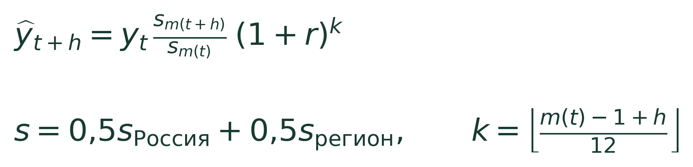
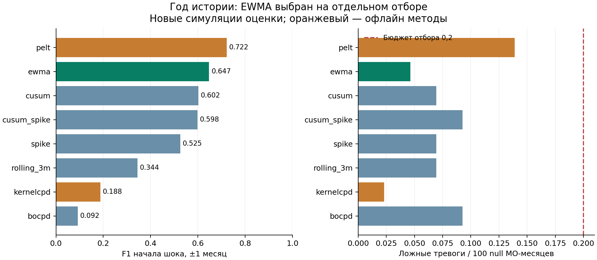
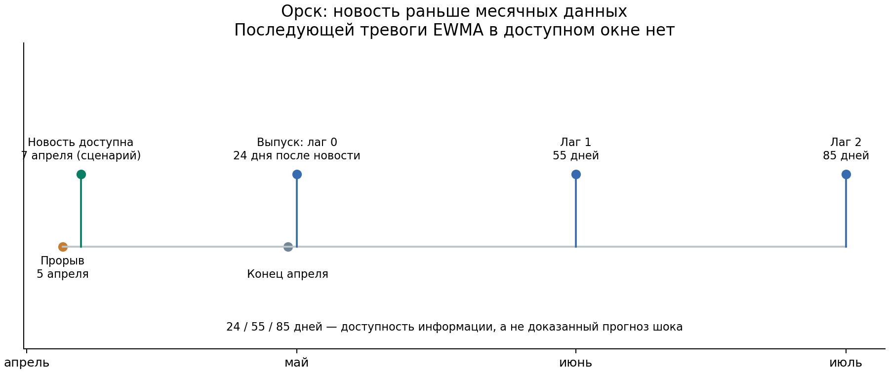

# Прогноз расходов МО и раннее обнаружение изменений

[Словарь](GLOSSARY.md) · [Интерфейс](../../dashboard/index.html)

**Маршрут для жюри:** [результаты и материалы в README](../../README.md#результаты-и-материалы) · [презентация](../../artifacts/presentation.pdf), слайд 2 — карта, 19 — ограничения, 20 — итог · [одна команда проверки](../GETTING_STARTED.md#самый-быстрый-путь-для-жюри).

## 1. Решение в двух словах

Мы прогнозируем средние месячные безналичные расходы жителя муниципалитета по данным СберИндекса, используя последний известный уровень расходов и сезонные изменения региона за 2023 год. При переходе через новый год мы добавляем заранее опубликованный рост зарплат Росстата 17,2% и проверяем одну и ту же формулу на горизонтах 1, 3, 6 и 12 месяцев. После получения новых расходов сглаживаем ошибки прогноза и отмечаем необычные отклонения, которые аналитик должен проверить. Официальные новости связываем с регионом или муниципалитетом по справочнику и показываем только после предполагаемой даты их доступности, сохраняя отдельно дату события и дату публикации. На изученных данных модель снижает среднюю ошибку относительно Prophet, однако независимый временной тест и надёжное предсказание будущих реальных шоков ещё требуют новых данных.

**Прогноз:** региональный сезонный профиль с весом 0,5 и фиксированной поправкой годового роста Росстата, одна модель на 1/3/6/12 месяцев. **Расходная тревога:** EWMA логарифмических ошибок одношагового прогноза. **Новости:** отдельный контекст с датой доступности, географией и опережением месячных данных.

Прогнозная формула:

Профили обучены только по 2023 году. Поправка r = 0,172 — опубликованный номинальный рост зарплат октября 2023, замороженный до периода оценки. Она устраняет смещение при переходе сезонного профиля через новый год, включая h12. Зарплата используется как внешний ориентир масштаба роста, а не как тождество расходам. Регион с менее чем 10 пригодными рядами использует общероссийский профиль.

EWMA сглаживает остаток `log(факт / прогноз)`: `z_t = 0,45 × e_t + 0,55 × z_(t−1)`. Событие тревоги — первое превышение порога в непрерывном эпизоде. Порог закреплён на отдельном наборе синтетических рядов без сдвига; выбор метода — на другом наборе, до создания оценочных случайных наборов. Пропуски не заполняются будущими значениями.

## 2. Данные и доступность по времени

Обязательный датасет СберИндекса: **303126 строк, 2190 ID, шесть категорий, январь 2023 — декабрь 2024**. Показатель «Все категории» — средний месячный безналичный расход жителя, в рублях. Это не общий торговый оборот муниципалитета.

Когорта: 2075 МО с полной положительной историей 2023. Число оцениваемых МО зависит от фактов 2024; будущая полнота не используется для отбора. География соединяется через официальный ID, неоднозначные названия не подменяются. Снимок справочника получен позднее периода исследования; это ограничение пространственных признаков.

Источник поправки — доклад Росстата за январь–ноябрь 2023 с объявлением 27 декабря. Сценарий доступности — 28 декабря. Значение и дата подтверждены индексированными официальными страницами; прямой захват исходного PDF не удался. ИПЦ поздних версий данных используется для ретроспективной интерпретации. [Происхождение коэффициента](../../reports/growth_bridge_review/REPORT.md).

Исходный ручной новостной реестр: 27 документов, 30 связей утверждение–регион, 13 регионов и 21 эпизод. Даты события, публикации и доступности разделены. Историческая доступность не подтверждена: обычно принят сценарий публикация + 1 день. Отсутствие новости не означает отсутствие события. Источники и снимки хешированы.

## 3. Прогноз: модель и сравнение

Все модели в таблице оцениваются на одинаковых парах, лаг данных 0. MAE усредняется сначала внутри целевого месяца, затем по датам; единица — рубли среднего расхода жителя.

| Горизонт | Дат / пар | Prophet без годовой | Fourier3 | Prophet + профиль | Старый сезонный | Выбранная модель |
|---|---:|---:|---:|---:|---:|---:|
| 1 месяц | 12 / 24282 | 1815 | 2351 | 1595 | 984 | **932** |
| 3 месяца | 10 / 20233 | 1766 | 2467 | 1659 | 1626 | **1272** |
| 6 месяцев | 7 / 14162 | 2171 | 2904 | 1917 | 1922 | **1371** |
| 12 месяцев | 1 / 2023 | 2906 | 7433 | 2989 | 4701 | **1321** |

Три фиксированных Prophet: 72879 фактических обучений. Расширенное сопоставление десяти моделей на полной панели приведено ниже; Direct HGB на h12 не обучается из-за отсутствия годовых целей в истории 2023.

Одна модель выбрана по среднему нормированному MAE h1/3/6 для целей до июня 2024. Поздние MAE h1/3/6/12: **771 / 1041 / 1435 / 1321**. Правило составлено после изучения архива: поздняя часть не объявляется новым независимым тестом. Для раннего h6 только одна дата; для h12 раннего отбора нет.

R² представлены по уровням, внутри МО и годовым изменениям. На h12 YoY R² выбранной модели **−0,307**: поправка уровня заметно снижает MAE, но единый коэффициент роста не описывает различия динамики муниципалитетов. Within-MO R² h12 не определён из-за одной целевой даты. Временные проверки и границы статистического вывода приведены в разделе 3.2.

| Модель | h1 | h3 | h6 | h12 | R² внутри МО, h1 |
|---|---:|---:|---:|---:|---:|
| Сезонный наивный | 4086 | 4352 | 4359 | 4701 | -1.429 |
| Prophet: базовый | 1815 | 1766 | 2171 | 2906 | 0.240 |
| Prophet: Fourier 3 | 2351 | 2467 | 2904 | 7433 | -0.832 |
| Prophet + профиль | 1595 | 1659 | 1917 | 2989 | 0.451 |
| Сезонный профиль | 984 | 1626 | 1922 | 4701 | 0.782 |
| Иерархия 0,5 | 937 | 1521 | 1909 | 4701 | 0.804 |
| Direct HGB | 2147 | 1258 | 3176 | — | -0.765 |
| Chronos-2 | 2154 | 2710 | 4036 | 9458 | 0.037 |
| Chronos-2 + ковариата | 1924 | 2556 | 3588 | 8927 | 0.262 |
| Иерархия 0,5 + рост | 932 | 1272 | 1371 | 1321 | 0.819 |

Все строки используют 60 700 одинаковых пар; 2031 / 2031 / 2029 / 2023 МО и 12 / 10 / 7 / 1 дат. Таблица малой выборки из прежнего исследования сохранена как дополнительная диагностика и не смешивается с этой таблицей. [Полное сравнение](../../reports/foundation_expansion_review/FULLPANEL_REPORT.md).

### 3.1. Устойчивость к поправке роста

Сравнение проведено на одинаковых 60 700 парах, с фиксированным региональным весом 0,5. Значения MAE округлены до рублей:

| Поправка g | h1 | h3 | h6 | h12 |
|---|---:|---:|---:|---:|
| 0 | 937 | 1521 | 1909 | 4701 |
| ИПЦ 7,4%, постфактум | 849 | 1337 | 1639 | 2447 |
| Ноябрьский ИПЦ 7,48%, доступен | 849 | 1335 | 1636 | 2425 |
| Рост зарплат 17,2%, доступен | 932 | 1272 | 1371 | 1321 |

Ноябрьский ИПЦ опубликован 8 декабря 2023 и допустим на декабрьской дате прогноза; декабрьский годовой ИПЦ опубликован 12 января 2024 и не может быть входом этого происхождения. В полном фиксированном диапазоне 5–25% улучшаются h3/h6/h12 относительно отсутствия поправки, но h1 ухудшается при 20–25%. Зарплатный показатель не является лучшим на всех горизонтах: ноябрьский ИПЦ лучше на h1. Этот диагностический результат не заменяет выбранную единую модель набором победителей по отдельным горизонтам. Все фактически оценённые переходы календарного года исходят из декабря 2023; новых независимых повторов нет. [Таблицы и официальные источники](../../reports/growth_sensitivity_review/REPORT.md).

[Проверка утверждений](../../reports/presentation_claim_checks/REPORT.md) подтверждает непрерывный диапазон g от 7% до 17%: при k=0/1 прогноз аффинен по g, MAE выпукла и не превосходит максимума ошибки на двух границах. Этот максимум ниже лучшего проверенного Prophet на каждом горизонте. Это описательная устойчивость на тех же фактах 2024, не выбор новой ставки и не независимое превосходство.

### 3.1.1. Категорийный источник для маркетплейсов

Отдельно проверена ставка 23% по опубликованному 7 ноября 2023 росту интернет-торговли АКИТ за девять месяцев. При неизменном профиле и весе MAE составила **359 / 570 / 847 / 930**, против **369 / 586 / 869 / 1186** у общей ставки 17,2%. Источник улучшает собственную модель, особенно на h12, но Prophet с профилем остаётся лучше на h3/h6/h12 (**435 / 587 / 752**). Этот отраслевой показатель относится ко всей интернет-торговле, а не точно к категории СберИндекса. Опыт предложен после просмотра 2024; ставка не подбиралась по ошибкам, выбранная основная модель не заменена. [Источник и точные пары](../../reports/marketplace_growth_review/REPORT.md).

### 3.1.2. Адаптивный рост: отдельный кандидат для следующего года

Чтобы g был правилом метода, проверяем второй вариант: медиана трёх последних месячных медиан годового роста расходов МО своего региона; в каждом месяце требуется минимум 10 конечных положительных пар. При отсутствии годовой истории или недостатке пар — последний документированный доступный макропоказатель. На декабре 2023 обе версии используют Росстат 17,2%; для декабря 2024 медианная ставка по оцениваемым МО составляет **14,79%**. Профиль 2023 и региональный вес 0,5 не изменены.

На январь/март/июнь/декабрь 2025 отдельно сохранены **8092 прогнозов для тех же 2023 МО**. Медианный прогноз на 2,05% ниже фиксированной версии; в отдельных регионах он выше, диапазон изменения −6,01…+3,16%. Оба файла сохраняются, второй кандидат не заменяет основной результат. Новое правило предложено после просмотра 2024 и знакомства с указанным в отзыве национальным агрегатом 2025, поэтому предварительная независимая регистрация не заявляется. Агрегат не участвует в формуле; сопоставимых муниципальных фактов и новых MAE нет.

На изученном 2024 все четыре MAE точно совпадают: при каждом переходе года годовой истории ещё не было, а на остальных датах множитель g не действует. Поэтому эта диагностика не проверяет преимущества нового правила при замедлении следующего года. [Точное правило](../protocols/ADAPTIVE_GROWTH_HOLDOUT.md) · [Второй файл и хеши](../../reports/adaptive_growth_holdout_20261007/freeze_manifest.json).

### 3.2. Неопределённость результата

Выполнены 2500 парных повторных выборок муниципалитетов целиком, с сохранением всех их дат, и отдельная чувствительность с выбором регионов целиком. Разность MAE считается на одинаковых парах, каждый целевой месяц имеет одинаковый вес. Положительное снижение означает меньшую ошибку выбранной модели.

| Горизонт | Лучший проверенный Prophet | Снижение MAE | 95% интервал по МО | 95% интервал по регионам |
|---|---|---:|---:|---:|
| 1 месяц | Prophet + профиль | 41,53% | 40,72–42,33% | 37,23–45,50% |
| 3 месяца | Prophet + профиль | 23,34% | 22,26–24,39% | 19,63–26,73% |
| 6 месяцев | Prophet + профиль | 28,49% | 27,00–29,96% | 24,64–32,07% |
| 12 месяцев | Prophet без годовой сезонности | 54,53% | 52,34–56,59% | 49,02–59,92% |

Эти интервалы описывают неопределённость **по территориям при фиксированных изученных датах 2024 года**. Даже интервал h12 не оценивает будущие годы: у него только одна целевая дата. Региональная выборка учитывает зависимость внутри региона, но не общий российский шок.

Дополнительно рассчитан тест Диболда–Мариано по месячным средним разностям абсолютных ошибок: поправка на временную зависимость с лагом h−1 и коррекция для малой выборки. Исходная поправка Холма по шести проверкам h1/h3 не даёт уровня 5%. Дополнительная исследовательская чувствительность только для Prophet + профиль на h1/h3 даёт p=0,03406 на h1 и p=0,30684 на h3. Узкое семейство добавлено после просмотра результатов; его нельзя назвать заранее зарегистрированным или независимым подтверждением. Для h6 тест не публикуется по консервативному правилу минимального числа дат данного аудита; для h12 временная дисперсия не определена. Повторное исследование 2024 и выбор параметров не устраняются статистическим тестом. [Полные интервалы и тесты](../../reports/forecast_uncertainty_review/REPORT.md).

Для единого контроля «Prophet + профиль» на h12 снижение MAE составляет **55,80%**, 95% интервал по регионам **50,52–60,97%**. На слайде 5 теперь используется этот контроль на всех горизонтах; сравнение с лучшим проверенным Prophet остаётся в таблице выше.

### 3.3. Перенос по категориям

На каждой категории использованы одинаковые пары и заранее выбранный Prophet с сезонным профилем, без перенастройки поправки роста. Таблица показывает снижение MAE выбранной формулы относительно этого контроля; отрицательное значение означает более высокую ошибку.

| Категория | h1, % | h3, % | h6, % | h12, % |
|---|---:|---:|---:|---:|
| Все категории | 41,53 | 23,34 | 28,49 | 55,80 |
| Здоровье | 9,69 | 9,91 | 2,34 | 28,44 |
| Маркетплейсы | 1,21 | −34,73 | −48,11 | −57,62 |
| Общественное питание | 47,29 | 34,25 | 38,70 | 54,95 |
| Продовольствие | 51,11 | 36,74 | 22,26 | −86,76 |
| Транспорт | 31,47 | 17,55 | 26,02 | 52,06 |

У общей суммы сравнение с **лучшим из трёх** Prophet на h12 даёт 54,53%; в этой таблице сравнение с одним заранее закреплённым Prophet даёт 55,80%. Это разные контрольные модели. Единого преимущества по всем категориям нет: гипотеза общего коэффициента роста для маркетплейсов и продовольствия на длинном горизонте не подтверждается. Отдельная ставка по категории после просмотра ошибок не выбирается. Исходное сравнение пяти новых категорий потребовало 121 465 обучений Prophet и около 60 минут на данной машине; повтор из совместимых локальных промежуточных файлов не обучает их заново. [Полные MAE и контроль без роста](../../reports/category_growth_review/REPORT.md).

**Контроль по категориям:** настройки Prophet закреплены по исследованию «Все категории»; на остальных пяти категориях отдельно не подбирались. Это сравнение переноса одной формулы с одним фиксированным контролем, а не превосходство над оптимально настроенным Prophet каждой категории.

## 4. Готовые модели временных рядов

TimesFM 2.5, Moirai 2 и TiRex проверены без дообучения, на сезонном отношении и в фиксированном ансамбле 50/50 с сезонным контролем. Все варианты используют одни и те же 7532 пары: 251/251/252/252 МО на h1/h3/h6/h12. Ни один новый вариант не превосходит сезонный контроль или выбранную модель на всех проверенных горизонтах. Версии кода, весов и контрольные суммы закреплены; TiRex использует поддержанную upstream-версию для короткой истории. Нельзя гарантировать отсутствие наших исторических данных в предобучении современных весов.

Chronos-Bolt дообучен на всех 2075 пригодных муниципалитетах: контекст январь–июнь 2023, обучающие цели июль–сентябрь, проверка октябрь–декабрь. Зафиксирована одна эпоха, 17 пакетов, без остановки или выбора по 2024 году. MAE на общей малой выборке составляет 1886/2367/3901/10824 рубля. Дообучение улучшает собственный исходный Bolt на h1/h3/h6, ухудшает h12 и всё ещё уступает сезонному контролю. Сохранён также отдельный пилот на 300 МО; он не объявляется итоговым победителем.

Исходные десять сравниваемых моделей теперь проверены на **полной доступной панели**, 60 700 одинаковых пар. По горизонтам наблюдаются 2031/2031/2029/2023 МО из 2075 пригодных по 2023 году. Для Direct HGB h12 остаётся явно обозначенным сезонным запасным прогнозом: обучаемых годовых целей в 2023 году нет. Сохранённые Chronos-2 на пересечении полностью воспроизводят прежние прогнозы. [Новые модели](../../reports/foundation_expansion_review/REPORT.md) · [Полная панель](../../reports/foundation_expansion_review/FULLPANEL_REPORT.md).

## 5. Детекторы и региональный остаток

Новый опыт соответствует длине реальной истории: **12 месяцев обучения и 12 оценки**. Без сдвига, постоянный сдвиг, временный импульс; шум 0,03 и три амплитуды обоих знаков. 400 рядов без сдвига калибровки, 360 рядов отбора, 1080 новых рядов оценки. Сравниваются пять последовательных методов, CUSUM + spike и настоящие PELT/KernelCPD.

Две цели: все границы и начало шока. Возврат импульса остаётся границей первой цели, а во второй сопоставленный возврат нейтрален. Остальные лишние тревоги — FP. Однозначное сопоставление ±1 месяц.

Выбор: максимальный F1 начала среди последовательных методов с частотой ложных тревог ≤0,2 на 100 МО-месяцев без сдвига на отборе. **Выбран EWMA**, до чтения оценочных наборов. Общая калибровка CUSUM + spike проверена; победитель заранее не назначался.

| Метод | F1 всех границ | F1 начала | Recall начала | Частота ложных тревог / 100 МО-мес. | Задержка начала, мес. |
|---|---:|---:|---:|---:|---:|
| EWMA | 0,532 | **0,647** | 0,583 | 0,046 | 0,543 |
| CUSUM | 0,510 | 0,602 | 0,539 | 0,069 | 0,768 |
| CUSUM + spike | 0,504 | 0,598 | 0,539 | 0,093 | 0,376 |
| Spike | 0,443 | 0,525 | 0,496 | 0,069 | 0,258 |
| Rolling 3 месяца | 0,333 | 0,344 | 0,275 | 0,069 | 0,990 |
| BOCPD | 0,063 | 0,092 | 0,049 | 0,093 | 0,029 |
| PELT, офлайн | 0,697 | 0,722 | 0,581 | 0,139 | — |
| KernelCPD, офлайн | 0,133 | 0,188 | 0,104 | 0,023 | — |

Задержка условна на найденных началах; пропуски представлены recall. PELT доступен после всего окна — в среднем через 7,06 месяца после сопоставленных границ с месячным лагом выпуска. Это поздняя локализация. Старый опыт 36/24 месяцев сохранён в приложении; его профиль отбора и результаты не переписаны. Частота ложных тревог на синтетике не гарантирует ту же частоту на реальных данных.

[Протокол, параметры и все разрезы](../../reports/short_history_review/REPORT.md).

### 5.1. Региональный остаток

Дополнительный сигнал — логарифмический остаток МО минус медиана остатков **других** МО региона того же месяца. Для медианы требуются минимум пять конечных соседних значений; будущие месяцы не используются. Значение становится известно только после публикации расходов, география взята из снимка 2024 и не объявляется историческим винтажем. Пороги четырёх методов перенесены из синтетической калибровки без подстройки под Орск.

| Канал EWMA | Наблюдаемых МО-месяцев | Эпизоды | На 100 наблюдаемых месяцев |
|---|---:|---:|---:|
| Собственный остаток | 24282 | 145 | 0,597 |
| Относительно региона | 24081 | 18 | 0,075 |

Меньшая нагрузка мониторинга сама по себе не доказывает лучшую полноту или меньшую долю ложных тревог: структурные сдвиги расходов в реальной панели не размечены. Региональное вычитание убирает и синхронный региональный шок, поэтому собственный канал сохраняется отдельно.

## 6. Новости: согласование и извлечение

Публикация → дата доступности (следующий день) → месяц доступности → официальный ID региона или МО → признак или контекст сигнала. Каждая связь хранит источник и цитату; будущее событие или будущий расход не разрешаются на более ранней дате.

### 6.1. Исторический корпус

Через сохранённые ответы поискового индекса официальных сайтов восстановлена **81 уникальная публикация 2023–2024 годов из всех 13 регионов**. Даты заголовков не заменяют даты публикации; современные страницы с упоминанием 2024 года исключаются. Извлечены 63 датированных прогноза, включая шесть месячных прогнозов Новосибирской области, доступных в сценарии следующего дня до начала целевого месяца. Для них проверена региональная связка с фактическими расходами. Две страницы предупреждений Приморья проверены вручную: они предсказывают дальнейшие сильные дожди при уже существующем паводке; месячный сдвиг расходов из этого не следует.

**Граница вывода:** восстановлен частичный архив, а не полный исторический RSS-корпус. Тематический поиск не даёт надёжных отрицательных примеров. Предсказание будущих реальных сдвигов расходов остаётся неподтверждённым; новую MAE, recall или частоту ложных предупреждений этому корпусу не приписываем. [Проверка и результаты](../../reports/mchs_archive_review/REPORT.md), [правила](../protocols/MCHS_ARCHIVE_REVIEW.md).

### 6.2. Извлечение текста и количественная проверка

Локальная Qwen2.5-1.5B обработала 29 зафиксированных официальных текстов: исходный пилот на 12 страницах и ещё 17 сохранённых официальных страниц с подтверждённой датой публикации. Проверка полей принимает 5 подтверждённых фрагментов из 29. Содержимое входа ограничено 5500 символами; полнота сохранённых выдержек не заявляется. Поисковые сниппеты не заменяют тело статьи. [Расширенная партия и исключения](../../reports/news_event_extraction_review/expanded_batch/REPORT.md). Исходный строгий валидатор принял 2 ответа. Отдельный вариант проверки полей сохраняет 3 подтверждённых фрагмента, оставляя неподтверждённую дату события неизвестной. Поиск названий только внутри точной цитаты и официальный справочник дали две муниципальные связи; лишь Орск присутствует в исходной прогнозной панели. Это ретроспективная разработка извлечения, а не независимая оценка точности. [Тексты и исходные ответы](../../reports/news_event_extraction_review/REPORT.md) · [Проверка полей](../../reports/news_event_extraction_review/field_validation_variant/REPORT.md).

Для явно названных МО после доступности публикации фиксированный множитель 0,75 снижает порог EWMA на два месяца. Проверены отдельно ручной событийный реестр и реестр подтверждённых цитат Qwen: в обоих случаях число активных тревожных месяцев остаётся 148, эпизодов — 145. Глобальное снижение порога даёт 530 активных месяцев и 515 эпизодов. В Орске новая тревога не возникает. Полученные новости описывают уже происходящую эвакуацию и не предсказывают дату начала паводка. [Нагрузка и группа паводковых МО](../../reports/event_conditioned_review/REPORT.md).

Фиксированные поправки прогноза ±0,03 в логарифме на известных новостных целях также не улучшили MAE. Обученный новостной предиктор требует более полного исторического корпуса: отсутствие записи в выборочном архиве нельзя считать отсутствием события. GDELT сохранён как один исторический срез метаданных, не как полный корпус российских новостей. [Диагностика прогноза](../../reports/news_event_extraction_review/FORECAST_DIAGNOSTIC.md).

### 6.2.1. Восстановление исключённых страниц

7 октября 2026 повторно открыты 80 официальных URL, ранее представленных только поисковыми выдержками. Для 74 страниц видимая дата совпала с реестром и сохранён достаточный текст; шесть исключены с причинами. Та же Qwen, prompt и проверка цитаты приняли **7 новых фрагментов**. Вместе с прежними партиями — **103 разных текста, 12 проверенных фрагментов, 3 муниципальных ID**; в расходной панели присутствуют Орск и Ишимский район. Предыдущие 29 входов и ответы не изменены.

Новое муниципальное предупреждение: прогноз подтопления в Ишимском районе от 14 апреля 2024, доступность в сценарии 15 апреля, ID 2203 подтверждён цитатой и справочником. Подтверждение типа явления лексическое: оно не различает наступившее бедствие, предупреждение и благоприятный прогноз. Поэтому эти фрагменты не являются разметкой реализованных шоков. Общие региональные документы не распространяются автоматически на все МО.

Объединённые муниципальные связи доступны в четырёх наблюдаемых МО-месяцах. При прежнем пороге ×0,75 на два месяца число эпизодов осталось **145 → 145**, 0,597 на 100 наблюдаемых МО-месяцев; активных тревожных месяцев — 148 в обоих вариантах. Новая связка не доказала выигрыша детекции. Полнота статей и историческая неизменность страниц не подтверждены: это снимки официальных страниц, открытых в 2026, а не архивные версии 2024. [Входы, цитаты и нагрузка](../../reports/news_body_recovery_20261007/REPORT.md) · [протокол и запуск](../protocols/NEWS_BODY_RECOVERY.md).

### 6.3. Новости в неопределённости прогноза и отрицательные абляции

Новость с явно названным МО сообщает о возможном риске, но не определяет знак и величину изменения расходов. Поэтому проверена другая фиксированная гипотеза: точку оставляем прежней, а радиус иллюстративного 80% интервала расширяем ×1,5 только при доступном официальном сообщении. На тех же **18 парах, 9 МО и 6 датах** покрытие осталось **17/18 (94,4%)**, средняя ширина выросла **2852 → 4278 руб.**, интервальный штраф **3237 → 4362 руб.** (меньше лучше). Точечный MAE остался 614,59 руб. Выигрыш не получен; расширение не включается в основной прогноз. Это постфактум проверка, множитель предложен после просмотра 2024 и не калиброван по новостям. Исходный реестр этого опыта отличается от расширенного Qwen-корпуса детекции.

Интервалы используют ошибки трёх предыдущих завершённых месяцев и масштабы 2023. Все 18 пар имеют исходные границы. Расширение вложенного интервала само по себе увеличивает ширину и не уменьшает покрытие; для практической пользы нужны дополнительные доказательства. Интервальный штраф IS₀.₂ = (U−L) +10·max(L−y,0)+10·max(y−U,0) сочетает ширину и штраф за промах, [метод оценки](https://journals.plos.org/ploscompbiol/article?id=10.1371/journal.pcbi.1008618), §2.2. [Парные результаты и источники](../../reports/news_interval_review/REPORT.md), [конфигурация](../../configs/news_interval_review.json). Запуск: `python -m sberindex.external.news_interval_review`.

Предыдущие фиксированные сдвиги ±3% сохраняются как отрицательная проверка: на известных новостных парах MAE 614,59 → 940,01 / 1193,96 руб. Эти сдвиги не являются обоснованной оценкой эффекта события. [Прежний опыт](../../reports/news_event_extraction_review/FORECAST_DIAGNOSTIC.md).

Новостные признаки HGB на 22259 общих h1 парах изменили MAE **1349,27 → 1351,77**. Общего выигрыша нет. Это отрицательный, воспроизводимый результат; информативность краткой региональной новости в месячном прогнозе не предполагается автоматически.

Для каждой связи реестра с территориями рассчитана дата первой последующей тревоги расходов при сценариях выпуска: первый день после наблюдаемого месяца + 0/1/2 месяца. Выбранный EWMA и альтернативы применены без подбора порогов по событиям. Отсутствующие ряды, отсутствие пригодного h1 прогноза, события вне окна 2024 и отсутствие тревоги имеют разные статусы. **Для Орска и Оренбурга последующей тревоги нет:** численный lead time до тревоги не определён.

Новость Орска доступна по сценарию 7 апреля, после прорыва 5 апреля. Апрельские расходы доступны 1 мая / 1 июня / 1 июля: информация новости опережает месячные данные на **24 / 55 / 85 дней**. Это информационное опережение, а не доказанное обнаружение расходного шока. Без независимой разметки нельзя приписывать последующую тревогу именно новости. Сценарии задержки сдвигают доступность наблюдений и тревог; прогнозы используются из опыта лаг 0. По всей панели EWMA дал 145 эпизодов на 24282 наблюдаемых МО-месяца: 0,597 / 100. Это нагрузка мониторинга, не известная частота ложных тревог.

Белгород, Анапа и проверенные МО Курской области отсутствуют в сопоставимой расходной панели. Другой ID не подставляется. [Полный реестр сценариев](../../reports/news_alert_lead/REPORT.md).

## 7. Реальные примеры: Уфа, Яльчикский район, Орск

Графики Уфы, Яльчикского района и Орска используют сохранённые скользящие h1-прогнозы выбранной модели. Уфа и Орск фиксированы по названиям, район выбран по минимальному среднему расходу 2023 года среди пригодных районов/округов, без отбора по ошибкам 2024. Это расходный показатель, а не численность населения. Иллюстративные 80% интервалы нормируют ошибки той же модели на средние расходы 2023; квантиль оценивается по трём завершённым месяцам до цели. Их доступность предполагает лаг 0. Они отсутствуют в январе–марте, являются диагностикой на повторно изученном архиве и не дают независимой гарантии покрытия. [Месячные точки и калибровка](../../reports/presentation_comparison_cases/REPORT.md).

### 7.1. Орск: локальная динамика и отсутствие тревоги

Фактический разрыв годового роста Орска и Оренбурга: 2,03 п.п. в феврале, 1,84 в марте, 3,15 в апреле, 9,19 в мае, 6,23 в июне, 6,11 в июле. Среднее за выбранное окно май–июль — 7,18 п.п.; в августе разрыв 4,34, в октябре 6,01. Это изменение сравнительной динамики, а не постоянный эффект +7 п.п. и не причинная оценка паводка: Оренбург также пострадал.

**Ни один из четырёх замороженных методов не дал тревоги в Орске или Оренбурге в 2024 году ни на собственном, ни на региональном остатке.** В мае региональный остаток Орска равен 0,07861, но сглаженный счёт EWMA — 0,03449 при пороге 0,07428. Сравнивать сырой остаток с порогом EWMA некорректно. Поэтому утверждение о тревоге 1 июня и 55 днях до неё не подтверждается; срок до первой тревоги цензурирован. Публикация о паводке датирована 6 апреля, 7 апреля — сценарий доступности после неё, событие началось 5 апреля.

МФЦ Орска в публикации 6 мая сообщает о доступности с 2 мая помощи на наём жилья. Это подтверждает объявление меры поддержки, но не фактические даты платежей, муниципальные суммы или их влияние на расходы. Выплаты и восстановление остаются объясняющими гипотезами. [Муниципальный источник](https://мфц-орск.рф/2024/05/06/stala-dostupna-novaya-mera-podderzhki-predostavlenie-denezhnoj-vyplaty-na-naem-zhilogo-pomeshheniya-v-svyazi-s-chs/), [вся панель, сроки и кейс](../../reports/peer_residual_review/REPORT.md).

Майский региональный остаток Орска: 0,07861 лог-единицы, 16-е место из 2012 доступных майских МО по положительному отклонению. В пересчёте через expm1 это около 8,18% для отношения факта к прогнозу относительно медианы региональных остатков. Ранг 39/1998 не воспроизводится: среди 1998 МО с полным годом остатка абсолютный ранг 41, положительный ранг 15. Разрыв годового роста с Оренбургом 7,18 п.п. за май–июль — другой показатель и выбранное окно. Автоматической тревоги по прежним порогам нет.

## 8. Воспроизводимость и использование

Код: `src/sberindex/{forecasting,detection,external,reporting}`. Параметры: `configs/*.json`. Исходные данные и снимки: `data/`. Прогнозы, метрики, параметры и SHA256: `reports/`. История исследований остаётся в приватном репозитории; пакет сдачи не содержит историю Git.

Быстрая проверка: `python run_review.py --mode verify` и `PYTHONPATH=src python -m unittest discover -s tests`. Повтор новых расчётов: `python run_review.py --mode recompute`; выборочные команды приведены в отчётах блоков. Сетевой RSS сбор запускается отдельно и не влияет на закреплённые метрики. [Подробная инструкция](../GETTING_STARTED.md).

Практический результат — прогноз ожидаемого уровня расходов и список необычных отклонений с датой доступности и новостным контекстом для аналитика. Независимого периода 2025, исторических винтажей расходов и подтверждённых реальных меток шоков нет; решение представляется как воспроизводимое исследование и прототип мониторинга.

[Локальный интерфейс](../../dashboard/index.html) показывает сохранённые прогнозы по шести категориям, выбор горизонта и месяца, географические центры муниципалитетов, факт и прогноз, иллюстративные интервалы и очередь начала эпизодов EWMA. Интернет и API-ключи для просмотра не требуются. Новости фильтруются по территории и дате доступности. Это исследовательский просмотр результатов 2024 года; рабочая оценка будущих расходов и подтверждённые будущие шоки не заявляются. [Происхождение и ограничения интерфейса](../../reports/research_dashboard/REPORT.md).

### 8.1. Зафиксированный прогноз выбранной модели на 2025

8092 прогнозов для 2023 МО: январь, март, июнь, декабрь 2025. Модель, профиль 2023 и поправка 17,2% не перенастроены. Хеши и точное время расчёта сохранены в [манифесте](../../reports/selected_model_holdout_20261007/freeze_manifest.json); [протокол](../../reports/selected_model_holdout_20261007/REPORT.md). Целевые факты не читались; метрик нет. Прежний ансамбль 75/25 сохранён отдельно без изменения. Дополнительно зафиксирован второй кандидат с региональной динамикой роста; обе версии будут оцениваться на одинаковых ключах после получения фактов.

## 9. Ограничения

- Архив 2024 неоднократно использовался для разработки; новые статистические проверки не превращают его в независимый тест.
- Все оценённые переходы года начинаются в декабре 2023; h12 имеет одну целевую дату. Интервалы по МО и регионам условны на этих датах и не описывают перенос на будущие годы.
- Исторические версии расходов, справочника и реальные сроки выпуска не подтверждены. Нулевой лаг — допущение; для новостей используется публикация плюс один день.
- Иллюстративные интервалы используют прошлые ошибки и не дают независимой гарантии покрытия.
- Синтетическая частота ложных тревог не равна реальной. События МЧС и реформы — метки воздействия, не разметка истинных изменений расходов.
- Корпус новостей выборочный и неполный; отсутствие записи не означает отсутствие события. Выигрыш от новостей и предсказание будущих расходных шоков не установлены.
- Единый рост 17,2% не переносится одинаково на все категории. Даты предобучения готовых моделей не исключают попадания исторических данных в их обучение.
- Сопоставимые официальные факты 2025 не получены. Новые файлы прогнозов — исторические симуляции, вычисленные в 2026, а не прогнозы, реально выданные в 2024.

## 10. Приложение: отрицательные эксперименты

Проверен накопительный сигнал: годовой рост МО относительно остальных МО региона, с центром и порогом по январю–марту 2024, без будущих расходов при калибровке. На апреле–декабре CUSUM активен в 48,45% наблюдаемых месяцев, EWMA — в 36,57%. Такая нагрузка слишком высока для замены основного детектора; Орск в апреле–июне не обнаружен. Рассматриваемые кейсы уже были известны, поэтому независимая проверка не заявляется. Муниципальная реформа и паводок являются метками события или экспозиции, а не автоматически истинными разрывами расходов; реальная частота ложных тревог остаётся неизвестной. [Накопительный детектор и реальные случаи](../../reports/yoy_shift_review/REPORT.md).

Direct HGB на малой выборке улучшает h3, но ухудшает h1/h6; пространственные признаки ухудшили h1 на 0,78%. Результаты, полные параметры и отрицательные новостные абляции сохранены в отдельных отчётах, а не исключены из пакета.
