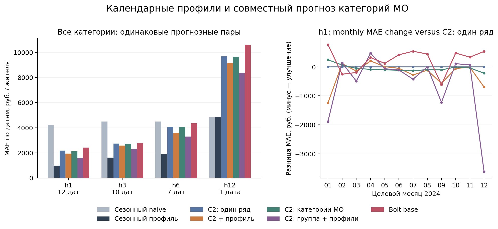

# Foundation: явные будущие ковариаты и группы категорий

Новые измеренные расчёты на фиксированной когорте 256 ID: четыре варианта Chronos-2 и Chronos-Bolt-base. Параметры и протокол зафиксированы до расчёта ошибок. Нормированные Chronos из прежнего опыта не повторялись. Ниже расходы «Все категории»; полные результаты всех шести категорий сохранены в summary.csv/monthly.csv.

На расходах «Все категории» собственный профиль снижает MAE Chronos-2 на 11.0/5.8/11.4/5.6% для h1/3/6/12; группы с шестью профилями — на 27.0/15.6/18.8/13.6%. Одна группировка почти не меняет результат и на h6 слегка ухудшает MAE. Сезонный pooled-контроль имеет меньшую MAE, чем каждый foundation-вариант, на всех четырёх горизонтах. Bolt-base хуже нового univariate C2 на всех горизонтах, хотя лучше прежнего tiny на ограниченных точных пересечениях. Эти числа описывают конкретную таблицу, не общий рейтинг моделей. По месяцам знак неоднороден, особенно в групповом варианте; выигрыш агрегата нельзя выдавать за устойчивое улучшение каждой даты.

Группировка задана явно: шесть категорий одного МО — шесть target-variates одного задания. У каждого МО отдельный group_id; межмуниципального обмена нет. Проверены фактические group_ids установленного датасета: [0×6,1×6], с профилями [0×12,1×12]. cross_learning=False сохраняет эти границы; True объединил бы задания батча. Это измеренный опыт группового внимания внутри МО, а не утверждение, что обычный batch predict_df включает cross-learning.

Ковариаты: только шесть pooled-профилей 2023, повторяемых по месяцу календаря. В одиночном варианте каждой категории дан её профиль; в групповом — все шесть профилей. Будущие факты расходов, включая будущие категории, не передавались. Расходы на origin входят в исторические targets; параметры модели не дообучались. Ошибки нового опыта не использовались для настройки или выбора варианта.

Из 256 выбранных МО все имеют полную историю 2023; с origin 2024-01 полный набор наблюдаемых категорий сохраняется у 251. Это правило по прошлому строже одиночной категории и одинаково для всех вариантов. Будущий факт отбирается только при оценивании; отсутствующие цели не восстанавливаются. Dates12/10/7/1 для h1/3/6/12; h12 — единственная дата 2024-12.

## Основные одинаковые пары

| h | model | dates | MO | n | MAE | YoY_MAE_pp | skill_profile |
| --- | --- | --- | --- | --- | --- | --- | --- |
| 1 | seasonal_naive | 12 | 251 | 3012 | 4226.892 | 15.225 | -3.317 |
| 1 | seasonal_pooled | 12 | 251 | 3012 | 979.145 | 3.818 | 0.000 |
| 1 | chronos2_univariate | 12 | 251 | 3012 | 2176.658 | 8.140 | -1.223 |
| 1 | chronos2_profile | 12 | 251 | 3012 | 1937.872 | 7.373 | -0.979 |
| 1 | chronos2_mo_group | 12 | 251 | 3012 | 2121.802 | 7.951 | -1.167 |
| 1 | chronos2_mo_group_profile | 12 | 251 | 3012 | 1589.279 | 6.195 | -0.623 |
| 1 | bolt_base_univariate | 12 | 251 | 3012 | 2416.246 | 8.967 | -1.468 |
| 3 | seasonal_naive | 10 | 251 | 2510 | 4484.022 | 16.090 | -1.746 |
| 3 | seasonal_pooled | 10 | 251 | 2510 | 1633.040 | 6.041 | 0.000 |
| 3 | chronos2_univariate | 10 | 251 | 2510 | 2733.999 | 9.875 | -0.674 |
| 3 | chronos2_profile | 10 | 251 | 2510 | 2575.889 | 9.503 | -0.577 |
| 3 | chronos2_mo_group | 10 | 251 | 2510 | 2701.897 | 9.722 | -0.655 |
| 3 | chronos2_mo_group_profile | 10 | 251 | 2510 | 2307.062 | 8.772 | -0.413 |
| 3 | bolt_base_univariate | 10 | 251 | 2510 | 2776.714 | 9.931 | -0.700 |
| 6 | seasonal_naive | 7 | 252 | 1758 | 4482.634 | 15.906 | -1.342 |
| 6 | seasonal_pooled | 7 | 252 | 1758 | 1913.641 | 6.994 | 0.000 |
| 6 | chronos2_univariate | 7 | 252 | 1758 | 4063.958 | 14.150 | -1.124 |
| 6 | chronos2_profile | 7 | 252 | 1758 | 3599.796 | 12.929 | -0.881 |
| 6 | chronos2_mo_group | 7 | 252 | 1758 | 4074.431 | 14.078 | -1.129 |
| 6 | chronos2_mo_group_profile | 7 | 252 | 1758 | 3300.262 | 11.994 | -0.725 |
| 6 | bolt_base_univariate | 7 | 252 | 1758 | 4353.319 | 14.804 | -1.275 |
| 12 | seasonal_naive | 1 | 252 | 252 | 4853.746 | 14.437 | 0.000 |
| 12 | seasonal_pooled | 1 | 252 | 252 | 4853.746 | 14.437 | 0.000 |
| 12 | chronos2_univariate | 1 | 252 | 252 | 9664.988 | 29.529 | -0.991 |
| 12 | chronos2_profile | 1 | 252 | 252 | 9125.362 | 28.049 | -0.880 |
| 12 | chronos2_mo_group | 1 | 252 | 252 | 9638.048 | 29.301 | -0.986 |
| 12 | chronos2_mo_group_profile | 1 | 252 | 252 | 8349.862 | 25.376 | -0.720 |
| 12 | bolt_base_univariate | 1 | 252 | 252 | 10586.530 | 31.612 | -1.181 |

MAE — среднее сначала по МО, затем с одинаковым весом целевых месяцев. skill_profile=1−MAE/MAE сезонного профиля. Положительное значение означает меньшую ошибку. PooledR² и within-MO R² есть в CSV; на h12 within-MO R² неопределён, поскольку у каждого МО один факт.

## Фиксированные контрасты

| h | contrast | delta_MAE | delta_pct | lower_error_dates |
| --- | --- | --- | --- | --- |
| 1 | chronos2_profile vs chronos2_univariate | -238.786 | -11.0% | 9/12 |
| 1 | chronos2_mo_group vs chronos2_univariate | -54.857 | -2.5% | 10/12 |
| 1 | chronos2_mo_group_profile vs chronos2_mo_group | -532.523 | -25.1% | 5/12 |
| 1 | bolt_base_univariate vs chronos2_univariate | 239.588 | 11.0% | 3/12 |
| 3 | chronos2_profile vs chronos2_univariate | -158.110 | -5.8% | 5/10 |
| 3 | chronos2_mo_group vs chronos2_univariate | -32.102 | -1.2% | 8/10 |
| 3 | chronos2_mo_group_profile vs chronos2_mo_group | -394.835 | -14.6% | 5/10 |
| 3 | bolt_base_univariate vs chronos2_univariate | 42.715 | 1.6% | 5/10 |
| 6 | chronos2_profile vs chronos2_univariate | -464.162 | -11.4% | 6/7 |
| 6 | chronos2_mo_group vs chronos2_univariate | 10.473 | 0.3% | 2/7 |
| 6 | chronos2_mo_group_profile vs chronos2_mo_group | -774.169 | -19.0% | 4/7 |
| 6 | bolt_base_univariate vs chronos2_univariate | 289.361 | 7.1% | 3/7 |
| 12 | chronos2_profile vs chronos2_univariate | -539.626 | -5.6% | 1/1 |
| 12 | chronos2_mo_group vs chronos2_univariate | -26.940 | -0.3% | 1/1 |
| 12 | chronos2_mo_group_profile vs chronos2_mo_group | -1288.186 | -13.4% | 1/1 |
| 12 | bolt_base_univariate vs chronos2_univariate | 921.542 | 9.5% | 0/1 |

Отрицательная delta означает меньшую ошибку. По месяцам видно, устойчив ли знак, а не только агрегат. Эти различия описательные; муниципалитеты и overlapping origins не независимы, формальная значимость и победитель не объявляются. Крупнее не гарантирует лучше: Bolt-base отдельно сопоставлен с Chronos-2 и сезонными контролями.

## Прежние tiny / сильные Prophet на точных пересечениях

cached_reference_overlap.csv содержит только одинаковые territory/origin/target/horizon и проверенные факты. Прежнийtiny не покрывает все ранние h3/h6; его сокращённые dates нельзя смешивать с основной новой таблицей. Сильные Prophet взяты из отдельного фиксированного опыта; ни одна прежняя прогнозная таблица не заменена.

| reference | h | model | dates | n | MAE |
| --- | --- | --- | --- | --- | --- |
| chronos_bolt_tiny | 1 | bolt_base_univariate | 11 | 2761 | 2141.472 |
| chronos_bolt_tiny | 1 | chronos_bolt_tiny | 11 | 2761 | 2209.802 |
| chronos_bolt_tiny | 3 | bolt_base_univariate | 4 | 1004 | 2521.160 |
| chronos_bolt_tiny | 3 | chronos_bolt_tiny | 4 | 1004 | 3025.982 |
| chronos_bolt_tiny | 6 | bolt_base_univariate | 1 | 251 | 8722.261 |
| chronos_bolt_tiny | 6 | chronos_bolt_tiny | 1 | 251 | 9579.408 |
| chronos_bolt_tiny | 12 | bolt_base_univariate | 1 | 252 | 10586.530 |
| chronos_bolt_tiny | 12 | chronos_bolt_tiny | 1 | 252 | 11059.877 |
| prophet_yearly3 | 1 | bolt_base_univariate | 12 | 3012 | 2416.246 |
| prophet_yearly3 | 1 | prophet_yearly3 | 12 | 3012 | 2402.434 |
| prophet_yearly3 | 3 | bolt_base_univariate | 10 | 2510 | 2776.714 |
| prophet_yearly3 | 3 | prophet_yearly3 | 10 | 2510 | 2507.442 |
| prophet_yearly3 | 6 | bolt_base_univariate | 7 | 1758 | 4353.319 |
| prophet_yearly3 | 6 | prophet_yearly3 | 7 | 1758 | 2935.850 |
| prophet_yearly3 | 12 | bolt_base_univariate | 1 | 252 | 10586.530 |
| prophet_yearly3 | 12 | prophet_yearly3 | 1 | 252 | 7619.137 |
| prophet_pooled_profile | 1 | bolt_base_univariate | 12 | 3012 | 2416.246 |
| prophet_pooled_profile | 1 | prophet_pooled_profile | 12 | 3012 | 1616.011 |
| prophet_pooled_profile | 3 | bolt_base_univariate | 10 | 2510 | 2776.714 |
| prophet_pooled_profile | 3 | prophet_pooled_profile | 10 | 2510 | 1664.966 |
| prophet_pooled_profile | 6 | bolt_base_univariate | 7 | 1758 | 4353.319 |
| prophet_pooled_profile | 6 | prophet_pooled_profile | 7 | 1758 | 1937.346 |
| prophet_pooled_profile | 12 | bolt_base_univariate | 1 | 252 | 10586.530 |
| prophet_pooled_profile | 12 | prophet_pooled_profile | 1 | 252 | 3002.206 |

## Ресурсы и происхождение

Final complete run inference+load: 545.9с; полное исполнение с записью/хешированием 560.3с. Peak process RSS 2.69GiB (<8GiB). CPU, 2 torch threads, batch_size96 series(C2),32(Bolt), модели загружались последовательно. Runtime по каждому origin/варианту сохранён. Новых fits:0. Все пять модельных вариантов посчитаны на полной выбранной когорте 256 ID, без уменьшения выборки ради ресурсов.

chronos-forecasting 2.3.2; torch 2.14.0. Chronos-2 revision `29ec3766d36d6f73f0696f85560a422f50e8498c`; Bolt-base revision `5d9f166d69f47aef3401367a7b842e78fe97b121`. В audit.json — SHA256 исходных файлов, checkpoint/config артефактов, установленного pipeline/dataset/preprocess и результатов. frozen_inputs.json фиксирует входы до inference. Само имя ревизии не является доказательством отсутствия training leakage.

Первый полный проход Chronos-2 остановился перед Bolt из-за неполного snapshot metadata (.gitattributes). После исправления конверсии RSS для переносимости macOS/Linux выполнен полный повтор с теми же параметрами. first_pass содержит прежние прогнозы/тайминги; repeat_verification.json подтверждает точное совпадение первого прохода C2/контролей с завершённым повтором. Указанные выше тайминги относятся к последнему полному запуску; setup/download и предыдущие попытки в них не входят.

## Проверки и границы вывода

Три теста утечки и отдельный тест конверсии RSS для macOS/Linux прошли после ожидаемых сбоев отсутствующей реализации. На реальных входах для всех origin проверено: изменение будущих расходов не меняет history eligibility, historical targets или future profile covariates. Профили считаются только по первым12месяцам; тест замены 2024 подтверждает их инвариантность. verify пересчитывает метрики, проверяет полное совпадение модельных пар и исходных actual/year-ago и SHA256 файлов проекта/сохранённых чисел. Хеши checkpoint и установленного API записаны для происхождения inference; проверка сохранённых метрик не требует заново загружать модель. {'saved_hashes': True, 'common_pairs': True, 'actuals': True, 'future_input_invariance': True, 'profile_invariance': True, 'saved_metrics': True}

Архив 2024 уже многократно изучен. [Chronos-2 опубликован20 октября 2025, Bolt 26 ноября 2024](https://github.com/amazon-science/chronos-forecasting#-news). Новые pinned checkpoints и установленноеПО не восстанавливают реально доступные модели 2024; точный training cutoff и возможное пересечение с архивом не доказаны. Это past-only входы в ретроспективном опыте, а не независимая временная валидация или deployable 2024 vintage. Uniform zero lag не моделирует настоящие публикационные задержки/ревизии.256-ID sample не равен полной когорте 2075 ID. h12 имеет одну дату. Главная модель не изменена.

Официальный [pipeline](https://github.com/amazon-science/chronos-forecasting/blob/main/src/chronos/chronos2/pipeline.py) подтверждает multivariate target и future_covariates. [Ответ maintainer о группировке](https://github.com/amazon-science/chronos-forecasting/discussions/464), [Bolt-base card](https://huggingface.co/amazon/chronos-bolt-base). Источники API проверены до inference; точная установленная реализация защищена хешами.

Воспроизведение: `PYTHONPATH=src ../venv/bin/python -m sberindex.forecasting.foundation_covariate_review`; проверка без загрузки моделей: та же команда с `--verify`; отчёт: `PYTHONPATH=src ../venv/bin/python -m sberindex.forecasting.foundation_covariate_review_report`.
