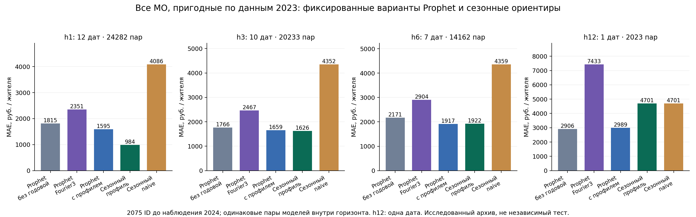

# Полная когорта: прогноз расходов муниципалитетов

6 октября 2026. Дополнение к прежнему сравнению на 256 ID. Цель — проверить перенос вывода на все пригодные МО, а не получить новый независимый временной тест.

## Дизайн

Из 2190 исходных ID выбраны 2075 с 12 положительными конечными месячными значениями 2023. 115 исключены только по обучающему году. Наличие фактов 2024 не использовано при отборе. Для каждого origin используется лишь известный префикс истории; отсутствующая история/цель учитываются отдельно.

Origins: декабрь 2023 — ноябрь 2024. h1/3/6/12 дают 12/10/7/1 целевых дат 2024. Общие ключи для всех пяти моделей; 60700 пар суммарно, 1279 исключений из-за истории и 271 из-за цели. Число оцениваемых МО по горизонтам 2031/2031/2029/2023 отличается от исходной пригодной когорты.

Три Prophet: отключённая годовая сезонность; multiplicative Fourier3 с фиксированным prior 0,1; регрессор общего профиля 2023 с prior 0,1 без стандартизации. Профиль обучен один раз по всем 2075 МО 2023. Два контроля: значение год назад и последнее наблюдение, умноженное на отношение сезонных профилей целевого/последнего месяца. Параметры не выбирались по 2024. Все прогнозы сравниваются в рублях среднего расхода жителя.

Гипотетический лаг доступности 0. 24293 задачи ID/origin, 72879 фактических обучений Prophet, 42.0 минуты на текущей машине. [Конфигурация](../../configs/full_cohort_review.json), [предварительный протокол](../../docs/protocols/FULL_COHORT_REVIEW.md), [аудит](audit.json).

## Результаты

MAE — среднее месячных MAE, чтобы каждый целевой месяц имел одинаковый вес.

| h | Дат / пар | Prophet без годовой | Prophet Fourier3 | Prophet + профиль | Сезонный профиль | Сезонный naive |
|---|---:|---:|---:|---:|---:|---:|
| 1 | 12 / 24282 | 1815 | 2351 | 1595 | 984 | 4086 |
| 3 | 10 / 20233 | 1766 | 2467 | 1659 | 1626 | 4352 |
| 6 | 7 / 14162 | 2171 | 2904 | 1917 | 1922 | 4359 |
| 12 | 1 / 2023 | 2906 | 7433 | 2989 | 4701 | 4701 |

На h1 и h3 сезонный профиль имеет меньшую MAE. На h6 Prophet + профиль немного лучше сезонного контроля: 1916,65 против 1922,13 руб. (0,285%). Это меняет прежний описательный вывод по 256 МО, где контроль был немного сильнее. Малое различие не объявляется статистически значимым. На h12 лучший из проверенных — Prophet без годовой сезонности, но доступна всего одна дата.

## Качество динамики и доверие

[Полные метрики](summary.csv) включают pooled/within-MO R², YoY MAE/R², h1 MoM R² и skill к обоим контролям. Pooled R² может быть высоким из-за масштаба МО. Например, сезонный профиль h3 имеет pooled R² 0,960, но within-MO 0,017 и YoY R² −0,859. Для h6 оба лидера имеют отрицательные within-MO и YoY R²; для h12 within-MO не определён. Поэтому прогноз уровней существенно сильнее доказательств прогнозирования динамики.

Нельзя выбирать универсального победителя по этим четырём строкам: горизонты имеют разные целевые даты, весь 2024 многократно исследовался. Вывод касается именно фиксированных моделей и пар этого опыта. Новые модели не автоматически заменяют рабочий выпуск. Полный перебор Prophet, реальная доступность винтажей и новый независимый период не проверены.

