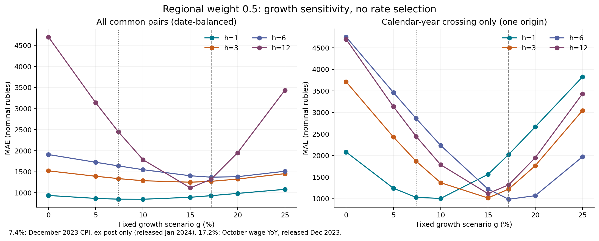

# Чувствительность MAE к фиксированной поправке роста

Региональный вес 0,5; неизменные 60 700 пар. MAE в номинальных рублях: сначала среднее по МО внутри target, затем равное среднее по датам. Сетка фиксирована до данного расчёта, после просмотра 2024; это описательная диагностика, без выбора g и без замены модели.

| g, % | h1 | h3 | h6 | h12 |
|---|---:|---:|---:|---:|
| 0 | 937.05 | 1521.40 | 1908.92 | 4700.73 |
| 5 | 866.92 | 1393.18 | 1724.96 | 3138.03 |
| 7.4 | 849.22 | 1337.11 | 1638.79 | 2447.20 |
| 10 | 847.15 | 1286.99 | 1549.26 | 1787.30 |
| 15 | 893.57 | 1251.56 | 1404.61 | 1117.11 |
| 17.2 | 932.30 | 1272.19 | 1370.66 | 1321.26 |
| 20 | 985.59 | 1326.40 | 1382.44 | 1950.21 |
| 25 | 1082.34 | 1454.57 | 1511.51 | 3434.49 |

Все ненулевые ставки сетки улучшают h3/6/12 относительно g=0; h1 улучшается лишь до 17,2% включительно, а 20% и 25% ухудшают его. При 17,2% выигрыш h1 лишь 0,51%; результаты существенно зависят от ставки. Сетка не обосновывает единственную оптимальную ставку.

| g, %: только k>0 | h1 | h3 | h6 | h12 |
|---|---:|---:|---:|---:|
| 0 | 2083.76 | 3713.93 | 4753.86 | 4700.73 |
| 7.4 | 1029.86 | 1871.04 | 2862.97 | 2447.20 |
| 17.2 | 2026.72 | 1221.81 | 986.03 | 1321.26 |

Для k>0 число пар h1/3/6/12: 2031/2031/2025/2023. Во всех случаях единственный origin — декабрь 2023. Общая MAE включает 12/10/7/1 дат и 24282/20233/14162/2023 пары. Количество МО не создаёт независимых временных повторений; независимость и статистическая значимость не заявляются.

## Источники и доступность

[Рост номинальной начисленной зарплаты октября 2023:17,2%](https://rosstat.gov.ru/storage/mediabank/osn-11-2023.pdf), доклад опубликован 27 декабря 2023; доступен декабрьскому origin при прежнем лаге 0. Это исходный фиксированный wage proxy, не рост реальных доходов.

[Декабрьский ИПЦ опубликован 12 января 2024](https://rosstat.gov.ru/central-news?page=52&per_page=10&print=1). [Ретроспективная таблица Росстата](https://rosstat.gov.ru/storage/mediabank/1_15-01-2025.html) подтверждает 7,42% декабрь/декабрь и 5,87% в среднем за 2023. Запрошенные 7,4% — округлённый декабрьский ИПЦ: только ex-post диагностика, использование как известного в декабре 2023 параметра создаёт look-ahead.

[Ноябрьский ИПЦ 7,48%](https://rosstat.gov.ru/storage/mediabank/194_08-12-2023.pdf) опубликован 8 декабря 2023 и доступен декабрьскому origin. Его отдельный сценарий не меняет запрошенную сетку:
MAE h1/3/6/12 = 848.88/1335.37/1635.98/2425.27 руб.

ИПЦ описывает цены фиксированной потребительской корзины, зарплата — начисленное вознаграждение работников. Номинальные расходы также зависят от объёмов, состава покупок, сбережений и покрытия SberIndex. Перенос любой ставки в расходы с эластичностью 1 — предположение, не экономическое тождество и не причинная оценка. Диагностические 5/10/15/20/25% не являются отдельными опубликованными макропоказателями.

## Проверенные Prophet варианты

| h | disabled | pooled_profile | yearly3 |
|---|---:|---:|---:|
| 1 | 1814.86 | 1594.59 | 2350.71 |
| 3 | 1765.66 | 1659.50 | 2467.47 |
| 6 | 2170.97 | 1916.65 | 2903.92 |
| 12 | 2905.80 | 2989.26 | 7432.79 |

Сравнения перенесены из существующей summary; нового переобучения Prophet и выбора модели нет. Для h1/3/6 вся сетка 0–25% сохраняет меньшую общую MAE, чем каждый проверенный Prophet вариант. Для h12 это верно для сценариев 7,4–20%; при 0/5/25% преимущество перед лучшим проверенным Prophet отсутствует. Этот факт относится к имеющейся выборке и не гарантирует перенос на новые годы.

Источники зафиксированы в sources.json; audit.json содержит доступность, ограничения и SHA256. Прямое открытие архива Росстата завершилось timeout; подтверждение дат получено из индексированного официального архива, историческая неизменность файлов не доказана.
