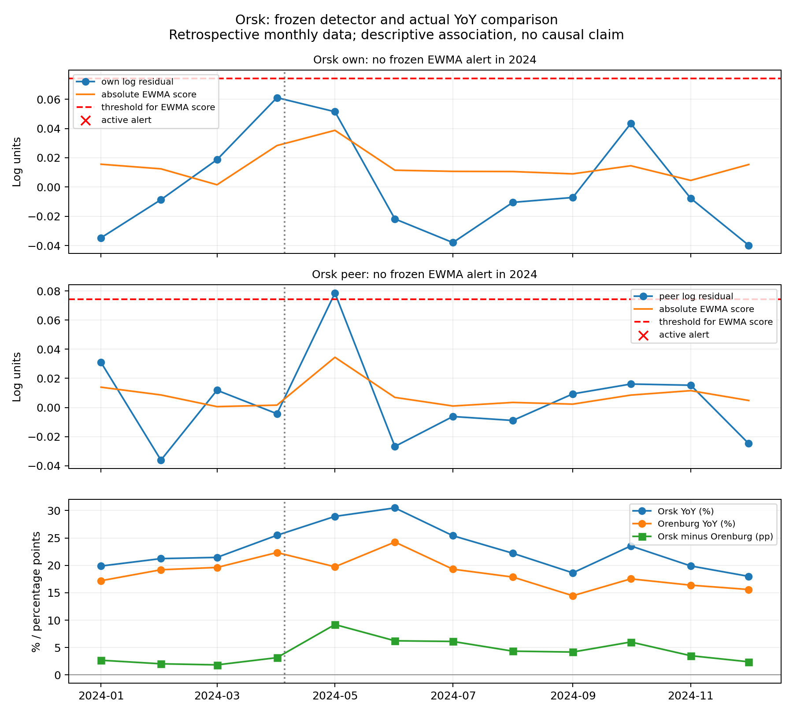

# Peer residual detector review

Forecast: hierarchy05_growth_bridge, h=1. Thresholds, EWMA alpha 0.45 and CUSUM drift 0.025 remain frozen. EWMA was selected on synthetic data; this retrospective real-data review is not independent temporal validation.

## Entire-panel monitoring burden

| signal | method | municipalities | observed_months | unavailable_months | active_alert_months | alert_episodes | municipalities_with_alert | active_per100_observed_months | episodes_per100_observed_months |
| --- | --- | --- | --- | --- | --- | --- | --- | --- | --- |
| own | ewma | 2031 | 24282 | 90 | 148 | 145 | 139 | 0.6095049831150646 | 0.5971501523762458 |
| own | spike | 2031 | 24282 | 90 | 307 | 287 | 264 | 1.2643110122724652 | 1.1819454740136728 |
| own | cusum | 2031 | 24282 | 90 | 59 | 53 | 43 | 0.24297833786343795 | 0.2182686763858002 |
| own | cusum_spike | 2031 | 24282 | 90 | 261 | 235 | 215 | 1.0748702742772425 | 0.9677950745408122 |
| peer | ewma | 2031 | 24081 | 291 | 21 | 18 | 16 | 0.08720568082720817 | 0.0747477264233213 |
| peer | spike | 2031 | 24081 | 291 | 45 | 39 | 36 | 0.18686931605830323 | 0.16195340725052945 |
| peer | cusum | 2031 | 24081 | 291 | 19 | 15 | 14 | 0.07890037789128358 | 0.062289772019434406 |
| peer | cusum_spike | 2031 | 24081 | 291 | 39 | 30 | 27 | 0.16195340725052945 | 0.12457954403886881 |

Burden counts are not FAR: no real spending-shift ground truth labels are available. Denominators count finite residual months only. New episodes are first active month after an inactive/unavailable month. Same-month regional residuals exclude the focal ID and require five peers. Missing months reset online state. Geography uses a 2024 snapshot, not historical geography vintages.

## Фактический годовой рост расходов, %; разрыв, п.п.

| target | orenburg_yoy_pct | orsk_yoy_pct | orsk_minus_orenburg_pp |
| --- | --- | --- | --- |
| 2024-01 | 17.193304670868635 | 19.87342924786013 | 2.6801245769914956 |
| 2024-02 | 19.19300766283525 | 21.224400871459693 | 2.0313932086244435 |
| 2024-03 | 19.612608105210484 | 21.44825956843597 | 1.835651463225485 |
| 2024-04 | 22.334147716594632 | 25.484111221449844 | 3.1499635048552115 |
| 2024-05 | 19.73722415795587 | 28.931039899465905 | 9.193815741510036 |
| 2024-06 | 24.247151875770978 | 30.478925653264287 | 6.231773777493309 |
| 2024-07 | 19.296437527912325 | 25.405530665842726 | 6.109093137930401 |
| 2024-08 | 17.86060504763496 | 22.199341021416807 | 4.338735973781848 |
| 2024-09 | 14.453262167287019 | 18.62833418197485 | 4.1750720146878315 |
| 2024-10 | 17.530015985850824 | 23.53920048409668 | 6.009184498245855 |
| 2024-11 | 16.379396900833363 | 19.888388838883884 | 3.508991938050521 |
| 2024-12 | 15.588699268607487 | 17.985723637043737 | 2.3970243684362504 |

May–July Orsk minus Orenburg gaps are 9.19, 6.23 and 6.11 pp (unweighted mean 7.18 pp). Thus approximately 7 pp describes that chosen three-month window; it is not a persistent full-year post-flood gap. Orenburg also experienced flooding and is not an untreated control. These data cannot establish flood causation. All four frozen methods produce no alert in either city in 2024. Orsk maximum own/peer EWMA scores are 0.03873/0.03449, below the 0.07428 threshold.

Выплаты и восстановление остаются гипотезами объяснения, а не доказанными причинами. Муниципальный МФЦ Орска в публикации 06.05.2024 сообщил о доступности с 02.05.2024 поддержки на наём жилья: https://мфц-орск.рф/2024/05/06/stala-dostupna-novaya-mera-podderzhki-predostavlenie-denezhnoj-vyplaty-na-naem-zhilogo-pomeshheniya-v-svyazi-s-chs/ . Это подтверждает объявление меры, а не фактические даты выплат, суммы получателям или причинный эффект на расходы. Снимок сохранён в data/external/peer_residual_review/mfc_support_page.json. Payments and recovery spending are plausible contextual hypotheses for higher observed YoY, not established causes. Primary-site research did not verify actual payment start dates or municipality-specific amounts. The official regional flood portal indexes recovery/support news in May (https://pavodok.orb.ru/), but its full page returned HTTP 403; federal payment-page retrieval timed out (https://government.ru/docs/52698/). No claim that payments began in May, and no payment-to-consumption attribution, is supported. See payment_context_source_metadata.json for retrieval limitations.

## Доступность новости и первая последующая тревога

| territory_id | signal | method | lag_months | news_published | news_available_scenario | event_onset | first_postnews_alarm_month | alarm_release | publication_to_alarm_days | availability_to_alarm_days | right_censored | observation_end_release |
| --- | --- | --- | --- | --- | --- | --- | --- | --- | --- | --- | --- | --- |
| 1665 | own | ewma | 0 | 2024-04-06 | 2024-04-07 | 2024-04-05 | — | — | — | — | True | 2025-01-01 |
| 1665 | peer | ewma | 0 | 2024-04-06 | 2024-04-07 | 2024-04-05 | — | — | — | — | True | 2025-01-01 |
| 1673 | own | ewma | 0 | 2024-04-06 | 2024-04-07 | 2024-04-05 | — | — | — | — | True | 2025-01-01 |
| 1673 | peer | ewma | 0 | 2024-04-06 | 2024-04-07 | 2024-04-05 | — | — | — | — | True | 2025-01-01 |

Publication: 6 April; event onset: 5 April; news available: 7 April under publication-plus-one-day scenario. Source: https://56.mchs.gov.ru/deyatelnost/press-centr/novosti/5249015; independent onset evidence: https://21.mchs.gov.ru/deyatelnost/press-centr/vse_novosti/5260528. Alarm dates use assumed following-month-first-day releases; lag 1/2 adds calendar months. Both publication-to-alert and assumed availability-to-alert days appear in the sensitivity CSV. No alarm is right-censored, with no invented lead. First subsequent means an episode from April onward, not a forced May detection.

Monthly residuals and contemporaneous regional peers only become observable on publication of monthly spending. A news lead, when observed, is a lead over statistical detection, not prediction before the flood. Actual historical release and ingestion timestamps remain unverified.

