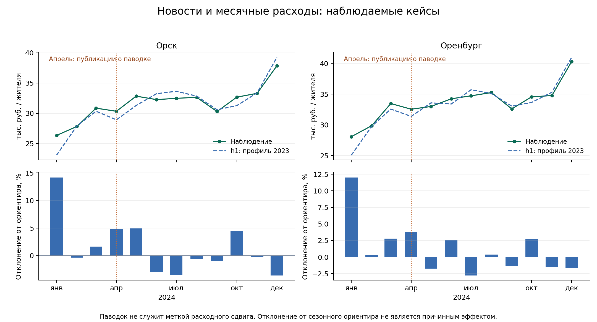

# Крупные события и доступность расходных кейсов

Используются только официально сопоставленные ID. Снимок географии ретроспективный. Дата сообщения не подменяет начало события, а внешнее событие не создаёт метку изменения расходов.

| Кейс | Сопоставленных ID | ID с расходами | Источник |
|---|---:|---:|---|
| Орск | 1 | 1 | [Публикация 2024-04-06](https://56.mchs.gov.ru/deyatelnost/press-centr/novosti/5249015) |
| Оренбург | 1 | 1 | [Публикация 2024-04-10](https://mchs.gov.ru/deyatelnost/press-centr/novosti/5252100) |
| Белгород | 1 | 0 | [Публикация 2024-05-12](https://www.interfax.ru/russia/960067) |
| Анапа | 1 | 0 | [Публикация 2024-12-17](https://anapa-official.ru/news/v-stanitse-blagoveshchenskoy-sobran-operativnyy-shtab-pod-rukovodstvom-gubernatora-regiona-/) |
| Курская область | 33 | 0 | [Публикация 2024-08-07](https://46.mchs.gov.ru/deyatelnost/press-centr/operativnaya-informaciya/operativnye-sobytiya/5337327) |

Орск: апрельский расход 30327 руб., ориентир 28913 руб., отклонение +4.89%. Оренбург: апрельский расход 32547 руб., ориентир 31375 руб., отклонение +3.73%. 

Ориентир использует только последний известный уровень и замороженный общемуниципальный профиль2023. Это описательная проверка, без оценки причинного ущерба, статистической значимости или гарантии обнаружения. Monthly aggregation может скрыть локальные/краткие последствия и изменение состава операций.

Анапа и Белгород: выбранные официальные ID отсутствуют в расходной панели; МО Курской области по справочнику2024 тоже не имеют сопоставимых рядов. Другой ID или прокси региона не подставляется без документированного соответствия. Нельзя рассчитывать precision/recall/F1 расходных изменений на этих новостных событиях. Для Анапы также нет последующих2025месяцев для проверки устойчивого изменения.

Новости Орска6апреля об уже произошедшем прорыве5апреля не являются предупреждением до шока. Под условием публикация+1день сообщение доступно7апреля, через2дня после начала. Фактическая дата выпуска расходов неизвестна: leadtime к ней не вычисляется.

Воспроизведение: `PYTHONPATH=src python -m sberindex.reporting.review_real_cases`. Числа сохранены в observed_series.csv, отсутствие рядов в coverage.csv.
